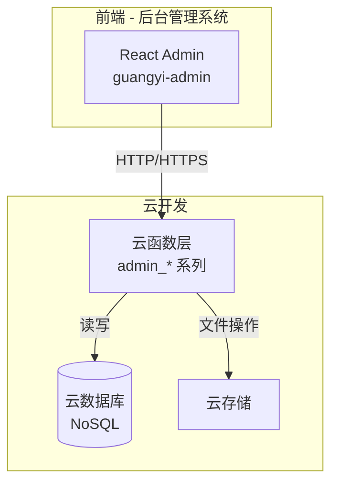

# 技术方案设计：后台管理云函数

## 1. 架构设计

### 1.1 整体架构



### 1.2 云函数目录结构

```
cloudfunctions/
├── common/
│   ├── auth.js           # 权限验证模块
│   ├── response.js       # 统一响应格式
│   └── utils.js          # 通用工具函数
├── admin_dashboard_stats/
│   ├── index.js
│   └── package.json
├── admin_users_list/
│   ├── index.js
│   └── package.json
├── admin_users_update/
│   ├── index.js
│   └── package.json
├── admin_designers_list/
│   ├── index.js
│   └── package.json
├── admin_designers_add/
│   ├── index.js
│   └── package.json
├── admin_designers_update/
│   ├── index.js
│   └── package.json
├── admin_products_list/
│   ├── index.js
│   └── package.json
├── admin_orders_list/
│   ├── index.js
│   └── package.json
├── admin_orders_update/
│   ├── index.js
│   └── package.json
├── admin_requests_list/
│   ├── index.js
│   └── package.json
├── admin_requests_update/
│   ├── index.js
│   └── package.json
├── admin_appointments_list/
│   ├── index.js
│   └── package.json
├── admin_appointments_update/
│   ├── index.js
│   └── package.json
├── admin_feedback_list/
│   ├── index.js
│   └── package.json
├── admin_feedback_reply/
│   ├── index.js
│   └── package.json
├── admin_toolkits_list/
│   ├── index.js
│   └── package.json
├── admin_toolkits_add/
│   ├── index.js
│   └── package.json
├── admin_toolkits_update/
│   ├── index.js
│   └── package.json
├── admin_courses_list/
│   ├── index.js
│   └── package.json
├── admin_courses_add/
│   ├── index.js
│   └── package.json
├── admin_courses_update/
│   ├── index.js
│   └── package.json
├── admin_calc_templates_list/
│   ├── index.js
│   └── package.json
└── admin_calc_templates_update/
    ├── index.js
    └── package.json
```

---

## 2. 技术栈

| 层级 | 技术 | 版本 |
|------|------|------|
| 云函数运行时 | Node.js | 18.x |
| 云开发 SDK | wx-server-sdk | latest |
| 数据库 | 云开发云数据库 | NoSQL |
| 云环境 | 腾讯云开发 | cloud1-5gb9c5u2c58ad6d7 |

---

## 3. 公共模块设计

### 3.1 权限验证模块 (common/auth.js)

```javascript
/**
 * 管理员权限验证
 * @param {string} openid - 用户openid
 * @returns {Promise<{isAdmin: boolean, user: object|null}>}
 */
async function verifyAdmin(openid) {
  const db = cloud.database()
  const user = await db.collection('users')
    .where({ _openid: openid, isDelete: 0 })
    .get()
  
  if (user.data.length === 0) {
    return { isAdmin: false, user: null }
  }
  
  const userData = user.data[0]
  return {
    isAdmin: userData.roles === 0,
    user: userData
  }
}
```

### 3.2 统一响应模块 (common/response.js)

```javascript
/**
 * 成功响应
 */
function success(data, message = 'success', extra = {}) {
  return {
    success: true,
    code: 'OK',
    message,
    data,
    timestamp: Date.now(),
    ...extra
  }
}

/**
 * 失败响应
 */
function error(code, errorMessage, details = null) {
  return {
    success: false,
    code,
    errorMessage,
    details,
    timestamp: Date.now()
  }
}

/**
 * 标准错误码
 */
const ErrorCodes = {
  INVALID_PARAMS: 'INVALID_PARAMS',
  MISSING_OPENID: 'MISSING_OPENID',
  FORBIDDEN: 'FORBIDDEN',
  NOT_FOUND: 'NOT_FOUND',
  SERVER_ERROR: 'SERVER_ERROR'
}
```

### 3.3 分页查询工具 (common/utils.js)

```javascript
/**
 * 分页查询
 * @param {Collection} collection - 数据库集合
 * @param {object} query - 查询条件
 * @param {object} options - 分页和排序选项
 */
async function paginatedQuery(collection, query, options = {}) {
  const {
    limit = 20,
    offset = 0,
    orderBy = 'createdAt',
    order = 'desc'
  } = options

  // 获取总数
  const countResult = await collection.where(query).count()
  const total = countResult.total

  // 获取数据
  const dataResult = await collection
    .where(query)
    .orderBy(orderBy, order)
    .skip(offset)
    .limit(limit)
    .get()

  return {
    data: dataResult.data,
    total,
    pagination: {
      limit,
      offset,
      hasMore: offset + dataResult.data.length < total
    }
  }
}
```

---

## 4. 数据库设计

### 4.1 集合索引设计

```javascript
// users 集合索引
{ _openid: 1 }
{ roles: 1, createdAt: -1 }
{ phoneNumber: 1 }

// designers 集合索引
{ rating: -1 }
{ projects: -1 }
{ 'spaceType': 1, isDelete: 1 }

// products 集合索引
{ categoryId: 1, status: 1 }
{ price: 1 }
{ stock: 1 }

// orders 集合索引
{ userId: 1, createdAt: -1 }
{ orderNo: 1 }
{ status: 1, createdAt: -1 }

// requests 集合索引
{ userId: 1, createdAt: -1 }
{ stage: 1, status: 1 }
{ designerId: 1 }

// appointments 集合索引
{ userId: 1, createdAt: -1 }
{ designerId: 1, createdAt: -1 }
{ status: 1 }

// feedbacks 集合索引
{ userId: 1 }
{ status: 1, createdAt: -1 }
{ type: 1 }
```

### 4.2 新增集合设计

#### toolkits 集合（工具包）

```javascript
{
  _id: ObjectId,
  toolkitId: String,        // 工具包ID，格式：TK+时间戳
  title: String,            // 标题
  description: String,      // 描述
  price: Number,            // 价格
  originalPrice: Number,    // 原价
  cover: String,            // 封面图URL
  files: [{                 // 资源文件列表
    name: String,
    url: String,
    size: Number,
    type: String
  }],
  category: String,         // 分类：cad/model/material/calculation/other
  tags: [String],           // 标签
  downloadCount: Number,    // 下载次数
  favoriteCount: Number,    // 收藏次数
  rating: Number,           // 评分
  ratingCount: Number,      // 评分人数
  status: String,           // 状态：active/inactive/pending
  isDelete: Number,         // 软删除：0=正常，1=删除
  createdAt: Date,
  updatedAt: Date
}
```

#### courses 集合（课程）

```javascript
{
  _id: ObjectId,
  courseId: String,         // 课程ID，格式：CO+时间戳
  title: String,            // 课程标题
  description: String,      // 课程描述
  cover: String,            // 封面图
  instructorId: String,     // 讲师ID（关联 designers 或自定义）
  instructorName: String,   // 讲师姓名
  instructorAvatar: String, // 讲师头像
  price: Number,            // 价格
  originalPrice: Number,    // 原价
  duration: Number,         // 总时长（分钟）
  lessonCount: Number,      // 课时数
  lessons: [{               // 章节列表
    lessonId: String,
    title: String,
    description: String,
    duration: Number,
    videoUrl: String,
    isFree: Boolean,
    sort: Number
  }],
  category: String,         // 分类
  level: String,            // 难度：beginner/intermediate/advanced
  tags: [String],           // 标签
  enrollCount: Number,      // 报名人数
  rating: Number,           // 评分
  ratingCount: Number,      // 评分人数
  status: String,           // 状态：draft/published/offline
  isDelete: Number,
  createdAt: Date,
  updatedAt: Date
}
```

---

## 5. 接口设计

### 5.1 admin_dashboard_stats

**请求参数：**
```javascript
{
  timeRange: 'today' | 'week' | 'month' | 'year'  // 可选，默认 'week'
}
```

**响应数据：**
```javascript
{
  success: true,
  code: 'OK',
  data: {
    overview: {
      totalUsers: Number,
      newUsersThisWeek: Number,
      totalDesigners: Number,
      totalOrders: Number,
      pendingOrders: Number,
      totalRevenue: Number,
      totalRequests: Number,
      pendingRequests: Number,
      totalAppointments: Number,
      pendingAppointments: Number
    },
    ordersTrend: [
      { date: '2024-12-01', count: 10, amount: 1000 },
      // ...近7天数据
    ],
    requestsDistribution: {
      residential: 10,
      commercial: 5,
      office: 3,
      hotel: 2
    }
  }
}
```

### 5.2 列表查询接口通用设计

**请求参数模板：**
```javascript
{
  // 分页
  limit: Number,      // 默认 20
  offset: Number,     // 默认 0
  
  // 排序
  orderBy: String,    // 排序字段
  order: 'asc' | 'desc',
  
  // 筛选（按集合不同）
  filters: {
    status: String,
    type: String,
    // ...其他筛选条件
  },
  
  // 搜索
  keyword: String
}
```

**响应数据模板：**
```javascript
{
  success: true,
  code: 'OK',
  data: [/* 数据列表 */],
  total: Number,
  pagination: {
    limit: Number,
    offset: Number,
    hasMore: Boolean
  }
}
```

### 5.3 更新接口通用设计

**请求参数模板：**
```javascript
{
  id: String,         // 文档ID
  data: {             // 更新数据
    // 具体字段
  }
}
```

**响应数据模板：**
```javascript
{
  success: true,
  code: 'OK',
  data: {
    updated: 1
  },
  message: '更新成功'
}
```

---

## 6. 安全性设计

### 6.1 权限控制

1. **openid 获取**：通过 `cloud.getWXContext()` 获取，不信任前端传入
2. **管理员验证**：每个 admin_ 函数入口处验证 `roles === 0`
3. **软删除**：所有删除操作使用软删除，保留数据可追溯

### 6.2 数据验证

1. **必填字段验证**：入口处检查必填参数
2. **类型验证**：验证参数类型正确性
3. **范围验证**：如价格、数量等需验证合理范围

### 6.3 日志记录

```javascript
// 关键操作日志记录
console.log(`[ADMIN] ${functionName} - User: ${openid} - Action: ${action} - Target: ${targetId}`)
```

---

## 7. 测试策略

### 7.1 单元测试

- 每个云函数需覆盖以下场景：
  - 正常请求
  - 权限验证失败
  - 参数缺失
  - 数据不存在

### 7.2 集成测试

- 后台管理系统与云函数联调测试
- 数据一致性验证

---

## 8. 部署说明

### 8.1 云函数部署

使用 MCP 工具部署：
```
1. createFunction 创建新函数
2. updateFunctionCode 更新已有函数代码
```

### 8.2 环境配置

- 云环境 ID: `cloud1-5gb9c5u2c58ad6d7`
- 使用 `cloud.DYNAMIC_CURRENT_ENV` 动态获取环境

### 8.3 依赖管理

package.json 示例：
```json
{
  "name": "admin_xxx",
  "version": "1.0.0",
  "main": "index.js",
  "dependencies": {
    "wx-server-sdk": "latest"
  }
}
```

