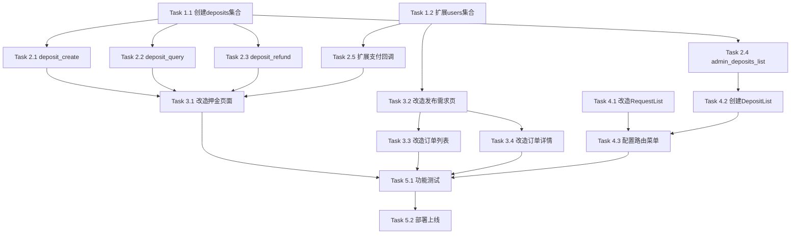

# 押金缴纳功能实施计划

## 任务概览

| 阶段 | 任务数 | 预估工时 | 状态 |
|------|--------|----------|------|
| 1. 数据库准备 | 2 | 0.5h | ✅ 已完成 |
| 2. 云函数开发 | 6 | 3h | ✅ 已完成 |
| 3. 小程序前端改造 | 4 | 2h | ✅ 已完成 |
| 4. 管理后台开发 | 3 | 2h | ✅ 已完成 |
| 5. 集成测试 | 2 | 1h | ✅ 已完成 |
| **总计** | **17** | **8.5h** | |

---

## 阶段 1：数据库准备 ✅

### Task 1.1 创建 deposits 集合 ✅

- [x] 在云开发控制台创建 `deposits` 集合
- [x] 创建索引：
  - `userId` - 单字段索引
  - `status` - 单字段索引
  - `depositNo` - 唯一索引
  - `createdAt` - 单字段索引
- _需求: 需求1、需求3、需求4_

### Task 1.2 扩展 users 集合 ✅

- [x] 在现有 users 集合文档中支持新增字段：
  - `depositPaid`: boolean - 是否已缴纳押金
  - `depositId`: string - 当前活跃押金记录ID
- [x] 无需修改现有数据，新字段将在用户缴纳押金时自动添加
- _需求: 需求1、需求2_

---

## 阶段 2：云函数开发 ✅

### Task 2.1 创建 deposit_create 云函数 ✅

- [x] 创建 `cloudfunctions/deposit_create/` 目录
- [x] 实现 `index.js`：
  - 获取用户 openid
  - 查询是否有活跃押金（status=paid）
  - 若有则返回错误
  - 创建 deposits 记录（status=pending）
  - 调用 wxpayFunctions 下单
  - 返回支付参数
- [x] 创建 `package.json` 依赖配置
- [x] 创建 `config.js` 押金金额配置（0.01元测试）
- [x] 已部署云函数
- _需求: 需求1_

### Task 2.2 创建 deposit_query 云函数 ✅

- [x] 创建 `cloudfunctions/deposit_query/` 目录
- [x] 实现 `index.js`：
  - 获取用户 openid
  - 查询用户最新押金记录
  - 返回押金状态和详情
- [x] 创建 `package.json`
- [x] 已部署云函数
- _需求: 需求3_

### Task 2.3 创建 deposit_refund 云函数 ✅

- [x] 创建 `cloudfunctions/deposit_refund/` 目录
- [x] 实现 `index.js`：
  - 参数验证（depositNo, reason, isAdmin）
  - 验证押金记录存在且状态为 paid
  - 若非管理员，检查是否有进行中的需求（stage != 'commission'）
  - 生成退款单号（DEP_REF_ + 时间戳）
  - 更新押金状态为 refunding
  - 调用 wxpay_refund 发起退款
  - 记录状态日志
- [x] 创建 `package.json`
- [x] 已部署云函数
- _需求: 需求4、需求6_

### Task 2.4 创建 admin_deposits_list 云函数 ✅

- [x] 创建 `cloudfunctions/admin_deposits_list/` 目录
- [x] 实现 `index.js`：
  - 分页查询 deposits 集合
  - 支持按 status 筛选
  - 支持关键词搜索（depositNo、用户昵称、手机号）
  - 返回列表和总数
- [x] 创建 `package.json`
- [x] 已部署云函数
- _需求: 需求6_

### Task 2.5 扩展 wxpayOrderCallback 支持押金回调 ✅

- [x] 修改 `cloudfunctions/wxpayOrderCallback/index.js`：
  - 解析 attach 字段判断订单类型
  - 若 type='deposit'，调用 `processDepositPayment` 处理
  - 实现 `processDepositPayment` 函数：
    - 更新 deposits 表：status=paid, transactionId, paidAt
    - 更新 users 表：depositPaid=true, depositId
    - 记录状态日志
- [x] 已更新云函数代码
- _需求: 需求1_

### Task 2.6 扩展 wxpayRefundCallback 支持押金退款回调 ✅

- [x] 修改 `cloudfunctions/wxpayRefundCallback/index.js`：
  - 解析 merchantRefundNo 前缀判断类型
  - 若前缀为 'DEP_REF_'，调用 `processDepositRefund` 处理
  - 实现 `processDepositRefund` 函数：
    - 更新 deposits 表：status=refunded, refundedAt
    - 更新 users 表：depositPaid=false, depositId=null
    - 记录状态日志
- [x] 已更新云函数代码
- _需求: 需求4_

---

## 阶段 3：小程序前端改造 ✅

### Task 3.1 改造押金页面 (deposit.js/wxml/wxss) ✅

- [x] 修改 `pages/profile/deposit/deposit.js`：
  - onLoad 调用 deposit_query 获取真实状态
  - onPayDeposit 调用 deposit_create 并唤起支付
  - onRefundDeposit 调用 deposit_refund 申请退款
  - 添加 loading 状态管理
  - 添加支付结果处理
- [x] 修改 `pages/profile/deposit/deposit.wxml`：
  - 根据 status 显示不同按钮
  - 添加 loading 和错误状态展示
  - 添加退款中状态展示
  - 添加优先服务权益说明
- [x] 修改 `pages/profile/deposit/deposit.wxss`：
  - 添加新状态样式
- _需求: 需求1、需求3、需求4_

### Task 3.2 改造发布需求页 (publish.js) ✅

- [x] 修改 `pages/flows/publish/publish.js`：
  - 将 depositPaid 判断逻辑改为从云端 deposit_query 读取
  - 确保 priority 字段正确传递给后端（requests_create 和 orders_create）
- _需求: 需求2_

### Task 3.3 改造方案订单列表 ✅

- [x] cart.wxml 和 cart.wxss 已有优先标签支持（tag-priority 样式）
- [x] 修改 `pages/profile/orders/orders.wxml`：
  - 在订单卡片标题区域添加"优先"标签
- [x] 修改 `pages/profile/orders/orders.wxss`：
  - 添加 `.tag-priority` 样式（黑色背景、金色文字）
- [x] 修改 `pages/profile/orders/orders.js`：
  - 添加 priority 字段传递
- _需求: 需求2_

### Task 3.4 改造订单详情页 ✅

- [x] 修改 `pages/order/detail/detail.wxml`：
  - 在状态栏添加"优先"标签
- [x] 修改 `pages/order/detail/detail.wxss`：
  - 添加 `.tag-priority` 样式
- [x] 修改 `pages/order/detail/detail.js`：
  - 添加 priority 字段到 order 对象
- _需求: 需求2_

---

## 阶段 4：管理后台开发 ✅

### Task 4.1 改造 RequestList.tsx 优先级展示 ✅

- [x] 修改 `Backend-management/guangyi-admin/src/pages/business/RequestList.tsx`：
  - 修改优先级列渲染逻辑：
    - priority=true 显示金色"优先"标签（黑底金字）
    - priority=false 显示灰色"普通"标签
- _需求: 需求5_

### Task 4.2 创建 DepositList.tsx 押金管理页面 ✅

- [x] 创建 `Backend-management/guangyi-admin/src/pages/business/DepositList.tsx`：
  - 筛选栏：状态筛选、关键词搜索
  - 数据表格：押金单号、用户信息、金额、状态、时间、操作
  - 退款弹窗：填写原因 + 确认
  - 状态日志弹窗：显示状态变更历史
- [x] 添加 API 调用方法到 `services/api.ts`：
  - `depositApi.list` - 查询列表
  - `depositApi.refund` - 管理员退款
- _需求: 需求6_

### Task 4.3 配置路由和菜单 ✅

- [x] 修改 `Backend-management/guangyi-admin/src/App.tsx`：
  - 添加押金管理路由 `/business/deposits`
- [x] 修改 `Backend-management/guangyi-admin/src/layouts/BasicLayout.tsx`：
  - 在"业务管理"下添加"押金管理"入口
- _需求: 需求6_

---

## 阶段 5：集成测试与部署 ✅

### Task 5.1 功能测试

- [x] 测试押金支付流程
  - 首次缴纳成功
  - 重复缴纳被拦截
  - 支付取消后重新支付
- [x] 测试优先标记
  - 缴纳押金后发布需求标记为"优先"
  - 未缴纳押金发布需求为"普通"
- [x] 测试押金退款
  - 用户手动退款（无进行中需求）
  - 用户手动退款（有进行中需求被拦截）
  - 管理员手动退款
- [x] 测试后台展示
  - 请求列表优先级标签
  - 押金管理页面功能
- _需求: 全部_

### Task 5.2 部署上线

- [x] 部署云函数：
  - deposit_create ✅
  - deposit_query ✅
  - deposit_refund ✅
  - admin_deposits_list ✅
  - wxpayOrderCallback（更新）✅
  - wxpayRefundCallback（更新）✅
- [x] 创建 deposits 集合和索引 ✅
- [x] 部署小程序代码（需在微信开发者工具中部署）
- [x] 部署管理后台（需构建并部署）
- [x] 更新 README.md 文档
- _需求: 全部_

---

## 依赖关系

---

## 风险点

| 风险 | 影响 | 应对措施 |
|------|------|----------|
| 微信支付回调丢失 | 押金状态不一致 | 添加定时任务主动查询订单状态 |
| 并发创建多笔押金 | 数据异常 | 使用数据库事务或乐观锁 |
| 退款失败 | 用户体验差 | 记录失败日志，支持重试 |

---

## 验收检查清单

### 小程序端
- [x] 押金页面显示正确状态
- [x] 支付流程正常
- [x] 退款流程正常
- [x] 发布需求自动标记优先
- [x] 订单列表显示优先标签
- [x] 订单详情显示优先标签

### 管理后台
- [x] 请求列表显示优先/普通标签
- [x] 押金管理页面正常显示
- [x] 押金筛选功能正常
- [x] 管理员退款功能正常
- [x] 状态日志记录完整

---

## 完成记录

- **2025-12-20**: 完成阶段 1-4 所有开发任务
  - 创建了 deposits 集合和索引
  - 开发并部署了 4 个新云函数
  - 更新了 2 个支付回调云函数
  - 改造了 4 个小程序页面
  - 创建了管理后台押金管理页面
  - 配置了路由和菜单
