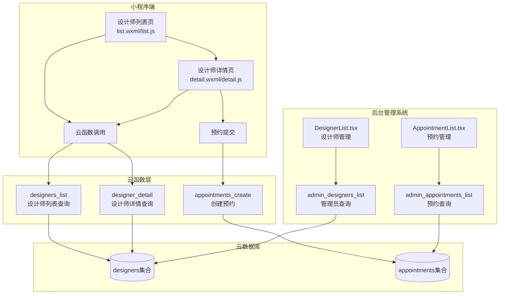
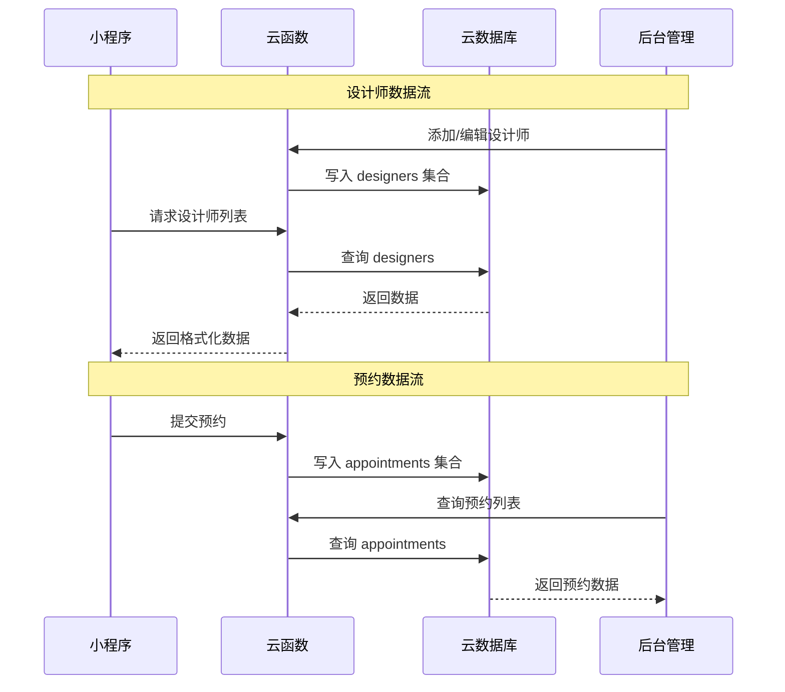
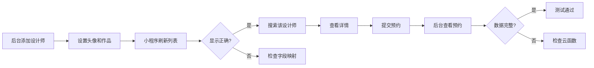

# 技术方案设计 - 设计师筛选功能同步对接

## 1. 架构概述

### 1.1 系统架构图



### 1.2 数据流向



## 2. 技术栈

| 层级 | 技术 | 版本 |
|-----|------|-----|
| 小程序前端 | 微信小程序原生 | 基础库 latest |
| 云函数 | Node.js + wx-server-sdk | Node.js 16+ |
| 后台管理 | React + TypeScript + Ant Design | React 18 |
| 数据库 | 微信云开发数据库 (MongoDB) | - |
| 云存储 | 微信云开发云存储 | - |

## 3. 详细设计

### 3.1 字段映射规范

#### designers 集合字段映射表

| 数据库字段 | 类型 | 小程序显示字段 | 后台显示字段 | 说明 |
|-----------|------|---------------|-------------|------|
| `_id` | string | `_id` | `_id` | 文档唯一ID |
| `name` | string | `name` | `name` | 姓名 |
| `title` | string | `title` | `title` | 职称 |
| `avatar` | string | `avatar` ⚠️改 | `avatar` ✅ | 头像URL |
| `bio` | string | `bio` ➕新增 | `bio` ✅ | 个人简介 |
| `rating` | number | `rating` | `rating` | 评分 |
| `projects` | number | `projects` ⚠️改 | `projects` ✅ | 完成项目数 |
| `price` | number | `price` | `price` | 咨询价格 |
| `experience` | number | `experience` ⚠️改 | `experience` ✅ | 从业年限 |
| `specialties` | array | `specialties` | `specialties` | 专业特长 |
| `certifications` | array | `certifications` ➕新增 | `certifications` ✅ | 认证列表 |
| `portfolioImages` | array | `portfolioImages` ➕新增 | `portfolioImages` ✅ | 作品图片 |
| `hasCalcExp` | boolean | `hasCalcExp` | `hasCalcExp` ✅ | 照度计算认证 |
| `spaceType` | array | `spaceType` | `spaceType` ✅ | 擅长空间类型 |
| `isDelete` | number | - | `isDelete` ✅ | 软删除标记 |
| `createdAt` | number | - | `createdAt` ✅ | 创建时间 |
| `updatedAt` | number | - | `updatedAt` ✅ | 更新时间 |

> ⚠️改 = 需要修改字段名，➕新增 = 需要新增显示，✅ = 已正确对接

### 3.2 云函数修改方案

#### 3.2.1 designers_list 云函数重构

**文件位置：** `cloudfunctions/designers_list/index.js`

**修改内容：**

```javascript
// 修改前（存在问题）
if (hasCalcExp) {
  q = q.where({ hasCalcExperience: true }) // ❌ 字段名错误
}
const orderField = sortBy === 'projects' ? 'projectCount' : // ❌ 字段名错误
                   sortBy === 'price' ? 'pricePerSqm' : 'rating' // ❌ 字段名错误

// 修改后（正确）
if (hasCalcExp) {
  q = q.where({ hasCalcExp: true }) // ✅ 正确字段名
}
const orderField = sortBy === 'projects' ? 'projects' : // ✅ 正确字段名
                   sortBy === 'price' ? 'price' : 'rating' // ✅ 正确字段名
```

**新增功能：**
1. 添加 `isDelete` 过滤条件
2. 支持关键词搜索传递
3. 优化空间类型筛选（使用 `spaceType` 数组查询）

#### 3.2.2 修复后的完整云函数

```javascript
const cloud = require('wx-server-sdk')
cloud.init({ env: cloud.DYNAMIC_CURRENT_ENV })

exports.main = async (event) => {
  const db = cloud.database()
  const _ = db.command
  const col = db.collection('designers')
  
  const {
    filters = {},
    sortBy = 'rating',
    page = 1,
    pageSize = 20,
    keyword = ''  // 新增：支持关键词搜索
  } = event
  
  const skip = Math.max(0, (page - 1) * pageSize)
  
  // 构建查询条件
  let conditions = {
    isDelete: _.neq(1)  // 新增：过滤已删除
  }
  
  // 空间类型筛选（修复：使用 spaceType 数组）
  const spaceType = String(filters.spaceType || '').trim()
  if (spaceType) {
    conditions.spaceType = spaceType  // 数组包含查询
  }
  
  // 最低评分筛选
  const minRating = Number(filters.minRating || 0)
  if (minRating > 0) {
    conditions.rating = _.gte(minRating)
  }
  
  // 照度计算认证筛选（修复字段名）
  if (filters.hasCalcExp) {
    conditions.hasCalcExp = true
  }
  
  // 关键词搜索（新增）
  if (keyword) {
    conditions.name = db.RegExp({ regexp: keyword, options: 'i' })
  }
  
  // 排序字段映射（修复）
  const orderFieldMap = {
    'rating': 'rating',
    'projects': 'projects',    // 修复：改为 projects
    'price': 'price',          // 修复：改为 price
    'experience': 'experience'
  }
  const orderField = orderFieldMap[sortBy] || 'rating'
  const order = sortBy === 'price' ? 'asc' : 'desc'
  
  // 查询数据
  const res = await col
    .where(conditions)
    .orderBy(orderField, order)
    .skip(skip)
    .limit(pageSize)
    .get()
  
  return { 
    success: true, 
    items: res.data || [],
    total: res.data?.length || 0
  }
}
```

### 3.3 小程序端修改方案

#### 3.3.1 设计师列表页 (list.wxml)

**修改点：**

| 行号 | 修改前 | 修改后 |
|-----|-------|--------|
| 107 | `src="{{item.avatarUrl}}"` | `src="{{item.avatar}}"` |
| 112 | `{{item.experienceYears \|\| 8}}年经验` | `{{item.experience \|\| 0}}年经验` |
| 129 | `{{item.projectCount}}单成交` | `{{item.projects \|\| 0}}单成交` |

**作品预览区域修改（第72-100行）：**
```xml
<!-- 使用 portfolioImages 替代硬编码图片 -->
<view wx:if="{{item.portfolioImages && item.portfolioImages.length > 1}}" class="portfolio-grid">
  <image class="main-image" src="{{item.portfolioImages[0]}}" mode="aspectFill"/>
  <view class="side-images">
    <image class="side-image" src="{{item.portfolioImages[1]}}" mode="aspectFill"/>
    <view class="image-count-box">
      <text>+{{item.portfolioImages.length}}</text>
    </view>
  </view>
</view>
<view wx:else class="portfolio-single">
  <image class="single-image" src="{{item.portfolioImages[0] || item.avatar || '/images/个人中心.png'}}" mode="aspectFill"/>
</view>
```

#### 3.3.2 设计师列表页 (list.js)

**修改点：**

1. **传递关键词参数：**
```javascript
// 修改 loadDesigners 函数
async loadDesigners() {
  this.setData({ loading: true })
  try {
    const { filters, sortBy, searchKeyword } = this.data  // 新增 searchKeyword
    const res = await wx.cloud.callFunction({
      name: 'designers_list',
      data: { 
        filters, 
        sortBy, 
        page: 1, 
        pageSize: 20,
        keyword: searchKeyword  // 新增：传递关键词
      }
    })
    // ...
  }
}
```

2. **实现空间类型筛选：**
```javascript
// 替换 toggleSpaceFilter 函数
toggleSpaceFilter() {
  wx.showActionSheet({
    itemList: ['住宅照明', '商业照明', '办公照明', '酒店照明', '清除筛选'],
    success: (res) => {
      const spaceTypes = ['residential', 'commercial', 'office', 'hotel', '']
      const selected = spaceTypes[res.tapIndex]
      this.setData({ 
        selectedSpace: selected,
        'filters.spaceType': selected
      })
      this.loadDesigners()
    }
  })
}
```

3. **添加搜索防抖：**
```javascript
// 新增防抖搜索
onSearchInput(e) {
  const value = e.detail.value
  this.setData({ searchKeyword: value })
  
  // 清除之前的定时器
  if (this.searchTimer) clearTimeout(this.searchTimer)
  
  // 设置新的定时器（500ms 防抖）
  this.searchTimer = setTimeout(() => {
    this.loadDesigners()
  }, 500)
}
```

#### 3.3.3 设计师详情页 (detail.wxml)

**修改点：**

| 行号 | 修改前 | 修改后 |
|-----|-------|--------|
| 15 | `src="{{designer.heroImage \|\| ...}}"` | `src="{{designer.portfolioImages[0] \|\| designer.avatar \|\| ...}}"` |
| 31 | `src="{{designer.avatarUrl}}"` | `src="{{designer.avatar}}"` |
| 44 | `{{designer.projectCount}}` | `{{designer.projects \|\| 0}}` |
| 49 | `{{designer.experienceYears \|\| 8}}年` | `{{designer.experience \|\| 0}}年` |

**作品展示区域（第79-98行）：**
```xml
<!-- 使用 portfolioImages 数组 -->
<view wx:if="{{designer.portfolioImages && designer.portfolioImages.length > 0}}" class="portfolio-grid">
  <view
    wx:for="{{designer.portfolioImages}}"
    wx:key="index"
    class="portfolio-item"
  >
    <image class="portfolio-image" src="{{item}}" mode="aspectFill"/>
  </view>
</view>
<view wx:else class="empty-content">
  <text class="empty-text">暂无作品展示</text>
</view>
```

### 3.4 后台管理系统确认

后台管理系统 `DesignerList.tsx` 已在之前的对话中完成修改，字段已与数据库对齐：

- ✅ `avatar` - 头像
- ✅ `bio` - 个人简介  
- ✅ `experience` - 从业年限
- ✅ `projects` - 完成项目数
- ✅ `price` - 咨询价格
- ✅ `certifications` - 认证列表
- ✅ `portfolioImages` - 作品图片
- ✅ `hasCalcExp` - 照度计算认证
- ✅ `spaceType` - 擅长空间类型

### 3.5 预约数据对接

#### 3.5.1 小程序预约表单字段（已正确）

当前 `appointments_create` 云函数已正确保存以下字段：
- `spaceType` - 空间类型（文本，如"住宅"）
- `area` - 设计面积
- `budget` - 预算范围
- `contactType` - 联系方式类型
- `contact` - 联系方式
- `remark` - 备注

#### 3.5.2 后台预约管理优化建议

`AppointmentList.tsx` 当前显示的 `spaceType` 使用 `SpaceTypeLabel` 映射，但小程序端保存的是中文文本（如"住宅"），需要调整：

```typescript
// 修改前（基于枚举映射）
<Tag color="blue">{SpaceTypeLabel[type as keyof typeof SpaceTypeLabel] || type}</Tag>

// 修改后（直接显示中文）
<Tag color="blue">{type || '-'}</Tag>
```

## 4. 测试策略

### 4.1 单元测试

| 测试项 | 测试内容 | 预期结果 |
|-------|---------|---------|
| 云函数字段查询 | 查询 `hasCalcExp=true` 的设计师 | 返回已认证设计师 |
| 云函数排序 | 按 `projects` 降序排序 | 项目数多的排在前面 |
| 云函数过滤 | 查询不包含 `isDelete=1` 的记录 | 不返回已删除设计师 |

### 4.2 集成测试

| 测试场景 | 操作步骤 | 预期结果 |
|---------|---------|---------|
| 设计师列表显示 | 进入设计师列表页 | 正确显示头像、年限、项目数 |
| 关键词搜索 | 输入"张三"并等待 | 显示名字包含"张三"的设计师 |
| 空间类型筛选 | 点击筛选，选择"商业照明" | 只显示擅长商业照明的设计师 |
| 设计师详情 | 点击某设计师进入详情 | 正确显示所有信息和作品 |
| 预约提交 | 填写表单并提交 | 预约成功，后台可查看 |

### 4.3 端到端测试



## 5. 部署计划

### 5.1 部署顺序

1. **第一步：部署云函数** - `designers_list`
2. **第二步：更新小程序** - `list.wxml`, `list.js`, `detail.wxml`, `detail.js`
3. **第三步：验证后台** - 确认 `DesignerList.tsx` 和 `AppointmentList.tsx` 正常

### 5.2 回滚方案

如果出现问题，可按以下顺序回滚：
1. 云函数支持版本回滚（云开发控制台）
2. 小程序代码保留原版本备份
3. 数据库数据不做结构变更，无需回滚

## 6. 安全考虑

1. **数据库权限**：`designers_list` 云函数只返回公开信息，不包含敏感数据
2. **输入校验**：搜索关键词进行正则转义，防止注入
3. **软删除**：已删除的设计师不会在小程序端显示，但数据保留用于审计

## 7. 风险评估

| 风险 | 影响 | 概率 | 缓解措施 |
|-----|------|-----|---------|
| 字段修改遗漏 | 部分数据显示异常 | 低 | 详细的字段映射表和代码审查 |
| 云函数部署失败 | 列表无法加载 | 低 | 本地测试后再部署 |
| 旧数据不兼容 | 部分设计师信息缺失 | 中 | 使用默认值兜底 |


