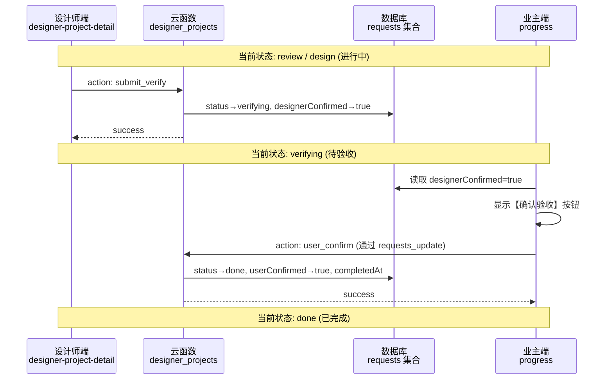

# 技术方案设计 — 移除工作流步骤 & 增加验收闭环

## 1. 架构概览

## 2. 涉及文件与改动范围

### 2.1 设计师端 — designer-project-detail

| 文件 | 改动类型 | 说明 |
|------|---------|------|
| `.wxml` | 删除 | 移除第49-62行的"工作流步骤"标题 + `.timeline` 区块 |
| `.wxml` | 修改 | 底部操作栏根据 `project.status` 和 `project.designerConfirmed` 动态渲染按钮 |
| `.wxss` | 删除 | 移除 `.timeline`、`.t-row`、`.t-dot`、`.t-text`、`.step-action`、`.btn-step` 相关样式 |
| `.js` | 删除 | 移除 `onToggleStep` 方法 |
| `.js` | 新增 | 新增 `onSubmitVerify` 方法 |
| `.js` | 修改 | `processProjectData` 中 `progressActive` 增加对 `verifying` 状态的判断 |

### 2.2 云函数 — designer_projects

| 改动类型 | 说明 |
|---------|------|
| 新增 action | `submit_verify`：验证设计师身份 → 校验项目归属 → 校验当前状态为 review/design → 更新 `status='verifying'`、`designerConfirmed=true`、`verifySubmittedAt=now` |
| switch 路由 | `exports.main` 中增加 `case 'submit_verify'` |

### 2.3 业主端 — progress

| 文件 | 改动类型 | 说明 |
|------|---------|------|
| `.wxml` | 修改 | 底部 `wx:else`（业主视角）区块增加条件判断：当 `designerConfirmed && !userConfirmed` 时显示【确认验收】按钮 |
| `.js` | 新增 | 新增 `onUserConfirmVerify` 方法，调用 `requests_update` 云函数更新 `userConfirmed=true`、`status='done'`、`completedAt` |
| `.js` | 修改 | `loadData` 中读取并透传 `designerConfirmed`、`userConfirmed` 字段到 `req` 对象 |
| `.js` | 修改 | `progressActive` 计算逻辑增加对 `verifying` 状态的处理 |

## 3. 数据库字段变更

在 `requests` 集合文档中新增以下字段（无需建表，写入时自动创建）：

| 字段 | 类型 | 说明 |
|------|------|------|
| `designerConfirmed` | Boolean | 设计师是否已提交验收 |
| `userConfirmed` | Boolean | 业主是否已确认验收 |
| `verifySubmittedAt` | Number (timestamp) | 设计师提交验收的时间 |
| `completedAt` | Number (timestamp) | 项目最终完成时间 |

`status` 字段新增枚举值：`verifying`（待验收）。

## 4. 底部操作栏状态矩阵（设计师端）

| 项目状态 | designerConfirmed | 底部按钮 |
|----------|------------------|---------|
| review / design | false | 【提交验收】(primary) + 【联系客户】+ 【联系平台】 |
| verifying | true | 提示文案"已提交验收，等待客户确认" + 【联系客户】+ 【联系平台】 |
| done | - | 【联系客户】+ 【联系平台】 |
| cancelled | - | 按钮禁用 |

## 5. 底部操作栏状态矩阵（业主端）

| 项目状态 | designerConfirmed | userConfirmed | 底部按钮 |
|----------|------------------|---------------|---------|
| verifying | true | false | 【确认验收】(primary) + 【联系客服】 |
| done | true | true | 原有按钮（修改订单等，已完成后可能禁用） |
| 其他 | - | - | 保持原有逻辑不变 |

## 6. 安全性

- `submit_verify` action 在云函数中执行，通过 `verifyDesigner` 校验身份和项目归属，防止越权操作。
- 业主端确认验收通过已有的 `requests_update` 云函数执行，openid 由云端 `getWXContext` 获取，无法伪造。
- 状态更新使用条件查询（`where` 含 status 条件），防止并发重复操作。

## 7. 不改动的部分

- 顶部 `van-steps` 步骤条（保留，仅调整 `verifying` 状态映射）
- 项目信息区块
- 客户信息区块
- 接单时间、加急标签
- 云函数 `list`、`detail` action
- 列表页 `designer-projects` 所有逻辑
