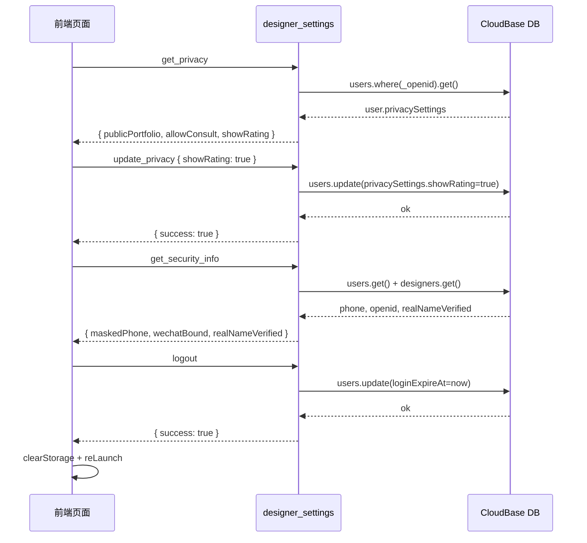

# 技术方案设计：设计师个人中心设置功能

## 架构概述

在现有 `designer_settings` 云函数基础上扩展，新增 4 个 action，无需创建新云函数。

```
designer_settings 云函数（扩展）
├── get_notifications      ✅ 已有
├── update_notifications   ✅ 已有
├── get_privacy            🆕 隐私设置读取
├── update_privacy         🆕 隐私设置更新
├── get_security_info      🆕 账号安全信息查询
└── logout                 🆕 退出登录（会话失效）
```

---

## 技术栈

- **云函数**：Node.js（wx-server-sdk），扩展现有 `designer_settings/index.js`
- **数据库**：CloudBase 文档型数据库
- **前端**：微信小程序原生 JS

---

## 数据库设计

### users 集合（扩展字段）

| 字段 | 类型 | 说明 |
|------|------|------|
| `notificationSettings` | Object | 通知设置（已有） |
| `privacySettings` | Object | 隐私设置（新增） |
| `privacySettings.publicPortfolio` | Boolean | 默认 true |
| `privacySettings.allowConsult` | Boolean | 默认 true |
| `privacySettings.showRating` | Boolean | 默认 false |
| `loginExpireAt` | Number | 会话过期时间戳（已有，logout 时设为当前时间） |

### designers 集合（只读）

| 字段 | 类型 | 说明 |
|------|------|------|
| `realNameVerified` | Boolean | 实名认证状态（已有，只读） |

---

## 接口设计

### get_privacy

```
请求：{ action: 'get_privacy' }
响应：{ success: true, data: { publicPortfolio, allowConsult, showRating } }
```

- 从 `users.privacySettings` 读取，合并默认值后返回
- 需要设计师身份验证（verifyDesigner）

### update_privacy

```
请求：{ action: 'update_privacy', settings: { publicPortfolio?, allowConsult?, showRating? } }
响应：{ success: true, message: '设置已保存' }
```

- 字段白名单校验：只允许 `['publicPortfolio', 'allowConsult', 'showRating']`，均为布尔值
- 使用点路径更新 `privacySettings.xxx`，避免覆盖其他设置字段
- 需要设计师身份验证

### get_security_info

```
请求：{ action: 'get_security_info' }
响应：{
  success: true,
  data: {
    maskedPhone,      // "138****8888"
    wechatBound,      // "已绑定" | "未绑定"
    realNameVerified  // "已认证" | "未认证"
  }
}
```

- 从 `users` 集合取手机号进行脱敏处理：`phone.replace(/(\d{3})\d{4}(\d{4})/, '$1****$2')`
- 微信绑定：`_openid` 存在即为「已绑定」
- 实名认证：查 `designers` 集合的 `realNameVerified` 字段
- 需要设计师身份验证

### logout

```
请求：{ action: 'logout' }
响应：{ success: true, message: '退出成功' }
```

- 将 `users.loginExpireAt` 更新为 `Date.now()`，使旧 token 立即过期
- **无需**设计师身份验证，只要 openid 存在即可（允许任意角色调用）

---

## 前端接入方案

| 页面 | 改动 |
|------|------|
| `designer-privacy.js` | onLoad → `get_privacy`；开关 onChange → `update_privacy`（含失败回滚） |
| `designer-security.js` | onLoad → `get_security_info`；data 绑定真实字段 |
| `designer-security.wxml` | 替换 hardcode 为 `{{maskedPhone}}`、`{{wechatBound}}`、`{{realNameVerified}}` |
| `designer-settings.js` | `onLogout` → 先调 `logout` action（失败忽略），再清缓存跳转 |

---

## 安全策略

- `get_privacy`、`update_privacy`、`get_security_info` 使用现有 `verifyDesigner`（roles 0 或 2）
- `logout` 只校验 openid，不校验角色（所有用户均可退出）
- 字段白名单：`update_privacy` 只接受预定义的 3 个布尔字段，防止客户端注入任意字段

---

## 数据流图


