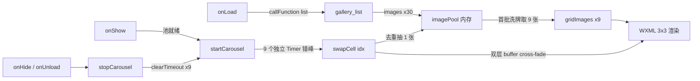
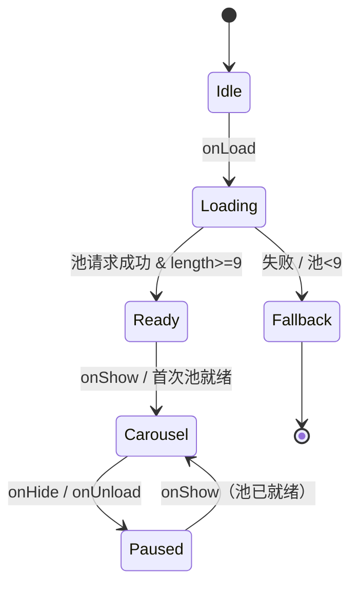

# 工具箱"实景灯光图库"九宫格轮播 - 技术方案

## 1. 架构总览



**关键设计点**

| 点 | 决策 |
|---|---|
| 数据来源 | 复用现有 `gallery_list` 云函数的 `list` action（已被 gallery 页用于加载图片）；toolbox 不新增云函数 |
| 池大小 | 30 张（云函数 `pageSize` 上限 40，30 张足够 9 格不重复且加载快） |
| 池缓存 | 仅在 `onLoad` 拉取一次；`onShow` 复用；不持久化 |
| 渲染单元 | 9 个 grid cell，每 cell 双 `<image>` 层（A/B），交替 src + opacity 实现 cross-fade |
| 调度 | 每 cell 独立 `setTimeout` 链；首次延迟 0–3s；间隔 5–8s；都是随机抖动 |
| 销毁 | `onHide` / `onUnload` 一并 `clearTimeout` 全部 9 个 |
| 降级 | 池失败/池小于 9：保留原 `<image src="{{galleryCover}}">` 单图模式 |

---

## 2. 数据契约

### 2.1 云函数请求

```js
wx.cloud.callFunction({
  name: 'gallery_list',
  data: { action: 'list', pageSize: 30 }
})
```

### 2.2 云函数响应（已存在，无需改动）

```ts
{
  success: true,
  data: {
    images: Array<{
      _id: string
      thumbUrl: string  // ← 我们只用这个字段
      title?: string
      tags?: string[]
      aspect?: string
      favoriteCount?: number
    }>,
    hasMore: boolean
  }
}
```

### 2.3 前端数据模型（toolbox.js `data`）

```ts
{
  // 已有
  galleryCover: string,     // 单图兜底
  coverLoaded: boolean,

  // 新增
  imagePool: string[],      // 30 张缩略图 URL 池
  poolReady: boolean,       // 池是否加载就绪（成功 & 长度 >= 9）
  gridImages: Array<{       // 9 格当前显示状态
    a: string,              // A 层 src
    b: string,              // B 层 src
    showB: boolean          // true 时显示 B 层（A 渐隐），切换时翻转
  }>
}
```

> 不在 `data` 中放 `timers` 数组（避免 setData 同步 / 触发不必要 render），改用 `this.timers = []` 实例属性持有。

---

## 3. WXML 结构（条件渲染：池就绪用九宫格，否则单图兜底）

```xml
<view class="bento-card col-span-2 row-span-2 gallery-card hover-scale" bindtap="navigateToGallery">

  <!-- 模式 A: 九宫格（池就绪） -->
  <view wx:if="{{poolReady}}" class="grid-bg">
    <block wx:for="{{gridImages}}" wx:key="index" wx:for-item="cell">
      <view class="grid-cell">
        <!-- A 层 -->
        <image class="cell-img {{cell.showB ? 'fade-out' : 'fade-in'}}"
               src="{{cell.a}}" mode="aspectFill" lazy-load></image>
        <!-- B 层 -->
        <image class="cell-img {{cell.showB ? 'fade-in' : 'fade-out'}}"
               src="{{cell.b}}" mode="aspectFill" lazy-load></image>
      </view>
    </block>
  </view>

  <!-- 模式 B: 单图兜底（池未就绪） -->
  <image wx:else wx:if="{{coverLoaded}}" class="gallery-bg" src="{{galleryCover}}" mode="aspectFill"></image>

  <!-- 渐变遮罩 + 文案 -->
  <view class="gallery-overlay"></view>
  <view class="gallery-bottom-shade"></view>     <!-- ★新增：底部加深，保文字可读 -->
  <view class="gallery-content"> ... 标题 / 描述 / 相机按钮 ... </view>
</view>
```

---

## 4. WXSS 设计

```css
.grid-bg {
  position: absolute; inset: 0;
  display: grid;
  grid-template-columns: repeat(3, 1fr);
  grid-template-rows: repeat(3, 1fr);
  gap: 0;                   /* 0 间隙：组成完整背景 */
  z-index: 1;
}

.grid-cell {
  position: relative;
  width: 100%; height: 100%;
  overflow: hidden;
}

.cell-img {
  position: absolute; inset: 0;
  width: 100%; height: 100%;
  transition: opacity 600ms ease;
}

.cell-img.fade-in  { opacity: 1; }
.cell-img.fade-out { opacity: 0; }

/* 底部加深，保白字可读（叠在原 .gallery-overlay 之上） */
.gallery-bottom-shade {
  position: absolute;
  left: 0; right: 0; bottom: 0;
  height: 200rpx;
  background: linear-gradient(to top, rgba(0,0,0,0.75) 0%, transparent 100%);
  z-index: 2;
  pointer-events: none;
}
```

> `gallery-card` 已有 `overflow: hidden` + 圆角，九宫格图片自动正确裁切于卡片轮廓内，无需额外处理 R4-AC4。

---

## 5. JS 状态机（toolbox.js 关键流程）



### 5.1 主要方法

| 方法 | 职责 |
|---|---|
| `loadGalleryPool()` | `onLoad` 调；`callFunction list` 拉 30 张；成功 → 初始化 `gridImages`、`setData({imagePool, gridImages, poolReady:true})`；失败 → 沿用 `loadGalleryCover()` 单图兜底 |
| `initGridImages(pool)` | 洗牌池前 9 个赋值给每格 `a`，`b='', showB:false` |
| `startCarousel()` | 池就绪时调；为 9 格各自启动 `scheduleNext(idx, randDelay(0,3000))` |
| `scheduleNext(idx, delay)` | `setTimeout(swapCell, delay)`，timeoutId 记入 `this.timers[idx]` |
| `swapCell(idx)` | 1) `pickNext(idx)` 抽下一张；2) `setData` 更新该格 inactive 层 src + 翻转 `showB`；3) 再次 `scheduleNext(idx, randDelay(5000,8000))` |
| `pickNext(idx)` | 从 `imagePool` 随机抽，过滤掉：该格当前 src + 其余 8 格当前 src（池子充足时）；池<9 时只过滤当前格 |
| `stopCarousel()` | `this.timers.forEach(clearTimeout)`；`this.timers = []` |

### 5.2 生命周期对接

```js
onLoad()    -> loadGalleryPool() （成功后会自动 startCarousel）
onShow()    -> 设置 tabBar；若 poolReady && timers 为空 → startCarousel()
onHide()    -> stopCarousel()
onUnload()  -> stopCarousel()
```

### 5.3 关键算法

**1) 池洗牌**（用 Fisher-Yates，避免偏置）
```js
function shuffle(arr) {
  const a = arr.slice()
  for (let i = a.length - 1; i > 0; i--) {
    const j = Math.floor(Math.random() * (i + 1))
    ;[a[i], a[j]] = [a[j], a[i]]
  }
  return a
}
```

**2) 不重复抽样**（满足 R2-AC3 / AC5）
```js
pickNext(idx) {
  const cur = this.activeSrcOf(idx)            // 该格当前显示的 src
  const others = this.allActiveSrcsExcept(idx) // 其余 8 格当前 src
  const pool = this.data.imagePool

  // 优先：池中排除 cur + others
  let candidates = pool.filter(s => s !== cur && !others.includes(s))
  if (candidates.length === 0) {
    // 池不足：仅排除 cur（满足 R2-AC5）
    candidates = pool.filter(s => s !== cur)
  }
  return candidates[Math.floor(Math.random() * candidates.length)]
}
```

**3) Cross-fade 切换**
```js
swapCell(idx) {
  const next = this.pickNext(idx)
  const cell = this.data.gridImages[idx]
  // 把 next 写到 inactive 层，再翻转 showB 触发 CSS transition
  if (cell.showB) {
    this.setData({ [`gridImages[${idx}].a`]: next, [`gridImages[${idx}].showB`]: false })
  } else {
    this.setData({ [`gridImages[${idx}].b`]: next, [`gridImages[${idx}].showB`]: true })
  }
}
```

**4) 错峰调度**
```js
startCarousel() {
  if (this.timers && this.timers.length) return  // 防重复（R3-AC5）
  this.timers = []
  for (let i = 0; i < 9; i++) {
    const firstDelay = Math.random() * 3000              // 0-3s
    this.scheduleNext(i, firstDelay)
  }
}

scheduleNext(idx, delay) {
  this.timers[idx] = setTimeout(() => {
    this.swapCell(idx)
    const next = 5000 + Math.random() * 3000             // 5-8s
    this.scheduleNext(idx, next)
  }, delay)
}
```

---

## 6. 边界与降级

| 场景 | 行为 |
|---|---|
| 云函数失败 | `console.warn` + 保留 `loadGalleryCover()` 单图模式；不启动 carousel |
| 池长度 1-8（极端） | 仍可启动，但 `pickNext` fallback 到只排除当前格 |
| 池长度 0 | 视为失败，走单图兜底 |
| 同一图片在池中多次出现 | 不影响（仅作为不同候选项） |
| 用户切 tab 极快 | `startCarousel` 内部判 `timers.length` 防重复 |
| 单格 setData 节流 | 9 格错峰本身已分散 setData，无需额外节流 |

---

## 7. 性能与流量评估

- 30 张缩略图，云函数后端走的是 `getTempFileURL`，前端 `<image>` 自带缓存
- 单张缩略图通常 30-80KB，30 张总流量约 **1.5-2.4MB**，仅在 onLoad 一次
- setData 频率：单格切换约每 5-8s 一次，9 格分散 ≈ 平均 0.7s/次，每次仅更新 2 个字段（path 写法），开销可忽略
- 销毁时 9 个 timer 全清，无后台泄漏

---

## 8. 测试策略

| 类型 | 方法 |
|---|---|
| 功能 | 真机/模拟器验证：进入工具箱见 9 格不同图；停留观察是否错峰切换；切到其他 tab 再回来不重复加载 |
| 兜底 | 临时把 `pageSize` 设为 0 或 mock 失败，验证降级到单图模式 |
| 性能 | 微信开发者工具 Performance 面板：观察长时间停留无内存增长、无 setData 阻塞 |
| 视觉 | 不同设备宽度（小屏/大屏）：九宫格保持等分、圆角裁切正确、底部文字始终清晰 |

---

## 9. 改动文件清单（预览）

| 文件 | 改动类型 | 概要 |
|---|---|---|
| `pages/toolbox/toolbox.wxml` | 修改 | gallery-card 内新增条件 `wx:if="{{poolReady}}"` 的九宫格 + 单图兜底分支；新增 `.gallery-bottom-shade` |
| `pages/toolbox/toolbox.wxss` | 新增样式 | `.grid-bg / .grid-cell / .cell-img / .fade-in / .fade-out / .gallery-bottom-shade` |
| `pages/toolbox/toolbox.js` | 修改 | 新增 `imagePool / poolReady / gridImages` data；新增 `loadGalleryPool / initGridImages / startCarousel / scheduleNext / swapCell / pickNext / stopCarousel`；接入 `onShow / onHide / onUnload` |
