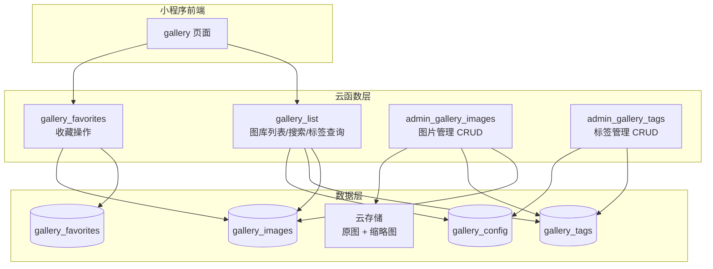

# 技术方案设计：灯光实景图库后端云函数

## 1. 技术架构概览



## 2. 技术栈

| 层级 | 技术选型 | 说明 |
|------|---------|------|
| 运行时 | Node.js 18.15 | 与项目现有云函数保持一致 |
| 云 SDK | wx-server-sdk | 小程序端云函数标准 SDK |
| 权限模块 | admin_auth.js | 复用现有的 `requireAdmin` 权限验证模块 |
| 数据库 | 云开发 NoSQL | 现有基础设施，无额外成本 |
| 文件存储 | 云开发 COS | 图片存储，支持 cloud:// 协议 |

## 3. 数据库设计

### 3.1 `gallery_images` 集合（图片元数据）

```json
{
  "_id": "自动生成",
  "title": "极简客厅暖光设计",
  "description": "采用3000K暖色温LED筒灯，营造温馨居家氛围",
  "tags": ["住宅", "客厅", "暖光", "极简风", "LED筒灯"],
  "keywords": "极简客厅暖光设计 住宅 客厅 暖光 极简风 LED筒灯 3000K 温馨",
  "fileID": "cloud://cloud1-xxx/gallery/full/img_001.jpg",
  "thumbFileID": "cloud://cloud1-xxx/gallery/thumb/img_001.jpg",
  "width": 1200,
  "height": 1600,
  "aspect": "aspect-3-4",
  "size": 2048000,
  "sortOrder": 1000,
  "viewCount": 0,
  "favoriteCount": 0,
  "status": 1,
  "createdBy": "admin_openid",
  "createdAt": 1712800000000,
  "updatedAt": 1712800000000
}
```

**索引设计：**

| 索引名 | 字段 | 用途 |
|--------|------|------|
| idx_status_sort | `{ status: 1, sortOrder: -1 }` | 默认列表分页 |
| idx_status_tags_sort | `{ status: 1, tags: 1, sortOrder: -1 }` | 标签筛选 |
| idx_status_created | `{ status: 1, createdAt: -1 }` | 按时间排序 |

### 3.2 `gallery_tags` 集合（标签字典）

```json
{
  "_id": "自动生成",
  "name": "暖光",
  "group": "光源类型",
  "sortOrder": 1,
  "imageCount": 2300,
  "status": 1,
  "createdAt": 1712800000000,
  "updatedAt": 1712800000000
}
```

### 3.3 `gallery_favorites` 集合（收藏记录）

```json
{
  "_id": "自动生成",
  "userId": "用户 openid",
  "imageId": "gallery_images 的 _id",
  "isDelete": 0,
  "createdAt": 1712800000000,
  "updatedAt": 1712800000000
}
```

**索引设计：**

| 索引名 | 字段 | 用途 |
|--------|------|------|
| idx_user_image | `{ userId: 1, imageId: 1, isDelete: 1 }` | 收藏查询/去重 |
| idx_user_created | `{ userId: 1, isDelete: 1, createdAt: -1 }` | 收藏列表分页 |

### 3.4 `gallery_config` 集合（全局配置）

```json
{
  "_id": "tag_version",
  "value": 1,
  "updatedAt": 1712800000000
}
```

用于存储 `tagVersion` 等全局配置项，轻量且易扩展。

## 4. 云函数设计

### 4.1 `gallery_list`（小程序端 - 列表/搜索/标签）

**调用方：** 小程序前端（无需登录）

**入参：**

```javascript
{
  action: 'list' | 'search' | 'tags' | 'detail',
  // action=list/search 时：
  tag: '暖光',             // 可选，单标签筛选
  tags: ['客厅', '暖光'],   // 可选，多标签筛选（AND）
  keyword: '极简',          // 可选，搜索关键词
  pageSize: 20,            // 每页条数，默认 20
  lastId: 'xxx',           // 游标分页，上一页最后一条的 _id
  sortBy: 'sortOrder',     // 排序字段：sortOrder | createdAt
  sortOrder: 'desc',       // 排序方向
  // action=tags 时：
  tagVersion: 1,           // 客户端缓存的标签版本号
  // action=detail 时：
  imageId: 'xxx'           // 图片 _id
}
```

**返回值：**

```javascript
// action=list/search
{
  success: true,
  data: {
    images: [
      {
        _id: 'xxx',
        title: '极简客厅暖光设计',
        tags: ['住宅', '客厅', '暖光'],
        thumbUrl: 'https://临时URL...',
        aspect: 'aspect-3-4',
        favoriteCount: 12
      }
    ],
    hasMore: true,
    lastId: '最后一条的_id'
  }
}

// action=tags
{
  success: true,
  data: {
    tags: [
      { name: '住宅', group: '场景类型', imageCount: 1280 },
      { name: '暖光', group: '光源类型', imageCount: 2300 }
    ],
    tagVersion: 1,
    notModified: false  // true 表示与客户端缓存一致，无需更新
  }
}
```

**游标分页实现：**

```javascript
// 第一页（无 lastId）
db.collection('gallery_images')
  .where({ status: 1 })
  .orderBy('sortOrder', 'desc')
  .limit(pageSize)
  .get()

// 后续页（有 lastId）
// 先查出 lastId 对应记录的 sortOrder 值，再用 _.lt 游标查询
db.collection('gallery_images')
  .where({
    status: 1,
    sortOrder: _.lt(lastSortOrder)  // 游标条件
  })
  .orderBy('sortOrder', 'desc')
  .limit(pageSize)
  .get()
```

### 4.2 `gallery_favorites`（小程序端 - 收藏操作）

**调用方：** 小程序前端（需登录）

**入参：**

```javascript
{
  action: 'add' | 'remove' | 'list' | 'check' | 'batchCheck',
  imageId: 'xxx',              // add/remove/check 时
  imageIds: ['a', 'b', 'c'],   // batchCheck 时
  pageSize: 20,                // list 时
  lastId: 'xxx'                // list 游标分页
}
```

**设计要点：**
- `add` 时自动对 `gallery_images` 的 `favoriteCount` 执行 `_.inc(1)`
- `remove` 时自动对 `gallery_images` 的 `favoriteCount` 执行 `_.inc(-1)`
- `batchCheck` 用于列表页一次性检查多张图片的收藏状态，避免 N+1 查询
- `list` 返回收藏列表时，需要关联查询 `gallery_images` 获取图片信息

### 4.3 `admin_gallery_images`（管理端 - 图片 CRUD）

**调用方：** Web 管理后台 / 小程序管理端（需 admin 权限）

**入参：**

```javascript
{
  action: 'add' | 'update' | 'delete' | 'list' | 'batchAdd',
  // add 时：
  title: '极简客厅暖光设计',
  description: '...',
  tags: ['住宅', '客厅', '暖光'],
  fileID: 'cloud://xxx/full/img.jpg',
  thumbFileID: 'cloud://xxx/thumb/img.jpg',
  width: 1200,
  height: 1600,
  sortOrder: 1000,
  // update 时额外需要：
  imageId: 'xxx',
  // delete 时：
  imageId: 'xxx',
  // batchAdd 时：
  images: [ { title, tags, fileID, ... }, ... ]  // 最多 50 条
  // list 时：
  page: 1,
  pageSize: 20,
  keyword: '',
  tag: '',
  status: 1     // 可选，管理端可查看下架图片
}
```

**设计要点：**
- 权限验证复用 `admin_auth.js` 的 `requireAdmin(db, _)`
- `add`/`update` 时自动生成 `keywords` 字段：`${title} ${tags.join(' ')} ${description的关键词}`
- `add` 时自动更新相关标签的 `imageCount` 计数 `_.inc(1)`
- `delete` 逻辑删除（`status: 0`），同时更新相关标签的 `imageCount` 计数 `_.inc(-1)`
- `batchAdd` 内部使用循环逐条写入（云开发不支持真正的批量 insert）
- `aspect` 字段根据 width/height 自动计算：
  - `height/width >= 1.2` → `aspect-3-4`
  - `width/height >= 1.2` → `aspect-4-3`
  - 其他 → `aspect-square`

### 4.4 `admin_gallery_tags`（管理端 - 标签 CRUD）

**调用方：** Web 管理后台（需 admin 权限）

**入参：**

```javascript
{
  action: 'add' | 'update' | 'delete' | 'list',
  // add 时：
  name: '暖光',
  group: '光源类型',
  sortOrder: 1,
  // update 时额外需要：
  tagId: 'xxx',
  // delete 时：
  tagId: 'xxx'
}
```

**设计要点：**
- 每次 `add`/`update`/`delete` 操作后，自动更新 `gallery_config` 中的 `tagVersion`（`_.inc(1)`）
- `delete` 为逻辑删除（`status: 0`），不影响已关联该标签的图片
- `add` 时检查同名标签是否已存在，防止重复

## 5. 云存储路径规范

```
gallery/
├── full/           # 原图（上传时的原始尺寸）
│   ├── img_001.jpg
│   └── img_002.jpg
├── thumb/          # 缩略图（前端列表用，建议 400px 宽）
│   ├── img_001.jpg
│   └── img_002.jpg
```

- **原图路径：** `gallery/full/{timestamp}_{随机ID}.{ext}`
- **缩略图路径：** `gallery/thumb/{timestamp}_{随机ID}.{ext}`
- 缩略图由管理端上传前生成，或后续可扩展云函数自动压缩

## 6. 安全设计

| 项目 | 策略 |
|------|------|
| admin 云函数权限 | 复用 `admin_auth.js` 的 `requireAdmin()` |
| 小程序端读操作 | `gallery_list` 无需登录，任何用户可浏览 |
| 小程序端收藏操作 | `gallery_favorites` 需要 OPENID，通过 `getWXContext()` 获取 |
| 云存储访问 | 通过 `cloud.getTempFileURL()` 生成临时链接返回前端 |
| 数据库安全规则 | gallery_images/tags/config 设为 `仅管理端可写`；gallery_favorites 设为 `仅创建者可读写` |

## 7. 性能优化策略

1. **游标分页**：`lastId` + `sortOrder` 游标查询替代 `skip()`，万级数据下性能稳定
2. **缩略图分离**：列表页只加载 thumb（~50KB），全屏预览加载 full
3. **标签版本缓存**：`tagVersion` 避免每次请求全量标签数据
4. **批量URL转换**：一次 `getTempFileURL` 调用转换整页（20条）的图片链接
5. **收藏批量检查**：`batchCheck` 一次查询当前页所有图片的收藏状态
6. **索引覆盖**：所有高频查询均有对应复合索引
