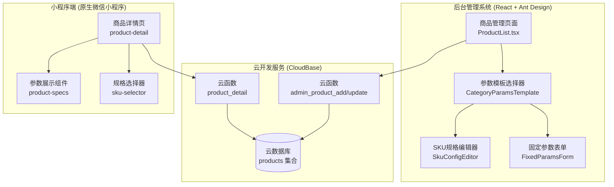

# 技术方案设计：灯具商品参数表单优化

## 1. 系统架构概览



## 2. 技术栈确认

| 层级 | 技术栈 | 说明 |
|------|--------|------|
| 后台管理前端 | React 18 + TypeScript + Ant Design 5.x | 保持现有技术栈 |
| 云开发 | CloudBase JS SDK + Node.js 云函数 | 保持现有架构 |
| 小程序前端 | 原生微信小程序 (WXML/WXSS/JS) | 保持现有架构 |
| 数据库 | 云开发数据库 (MongoDB 风格) | 保持现有集合 |

## 3. 数据结构设计

### 3.1 商品表 (products) 扩展

```typescript
// src/types/index.ts - 扩展 Product 接口

export interface Product {
  _id: string;
  productId: string;
  name: string;
  description: string;
  categoryId: string;           // 分类ID (关联参数模板)
  price: number;
  originalPrice: number;
  images: string[];
  coverImage: string;
  
  // ========== 新增字段 ==========
  
  /** 品牌信息 */
  brand?: string;
  
  /** 型号 */
  model?: string;
  
  /** 基于分类的参数模板数据 */
  categoryParams?: CategoryParamsData;
  
  /** 固定规格参数 (展示用，不影响价格) */
  fixedSpecs?: ProductFixedSpec[];
  
  // ========== 现有字段 (保持兼容) ==========
  skuConfig: SkuConfig;
  skuCombinations: SkuCombination[];
  specifications: ProductSpec[];     // 保持兼容旧数据
  stock: number;
  sales: number;
  status: 'active' | 'inactive';
  isDelete: number;
  tags: string[];
  seoTitle: string;
  seoKeywords: string;
  seoDescription: string;
  createdAt: Date;
  updatedAt: Date;
}

/** 分类参数数据 (根据分类动态变化) */
export interface CategoryParamsData {
  /** 分类模板ID */
  templateId: string;
  
  /** 参数值映射 { fieldKey: value } */
  values: Record<string, string | number | boolean | string[]>;
}

/** 固定规格参数 (仅展示) */
export interface ProductFixedSpec {
  /** 参数键 */
  key: string;
  
  /** 参数显示名称 */
  label: string;
  
  /** 参数值 */
  value: string | number | boolean;
  
  /** 单位 (可选) */
  unit?: string;
  
  /** 参数分组 */
  group: 'optical' | 'electrical' | 'physical' | 'functional';
  
  /** 是否为关键参数 (高亮展示) */
  important?: boolean;
}

/** 参数分组定义 */
export const SpecGroupLabels: Record<string, string> = {
  optical: '光学参数',
  electrical: '电气参数',
  physical: '物理参数',
  functional: '功能参数',
};
```

### 3.2 分类表 (categories) 扩展

```typescript
export interface Category {
  _id: string;
  name: string;
  parentId?: string;
  level: number;
  sort: number;
  icon?: string;
  productCount?: number;
  isDelete: number;
  createdAt: Date;
  updatedAt: Date;
  
  // ========== 新增字段 ==========
  
  /** 关联的参数模板ID */
  paramsTemplateId?: string;
}
```

### 3.3 参数模板配置 (前端常量)

> 💡 **设计决策**：参数模板采用前端常量配置，不存储在数据库
> - 优点：修改方便，无需数据库迁移，启动速度快
> - 缺点：需要发版更新
> - 理由：灯具参数标准相对稳定，变更频率低

```typescript
// src/config/categoryParamsTemplates.ts

/** 参数字段定义 */
export interface ParamFieldDef {
  /** 字段键 */
  key: string;
  
  /** 显示名称 */
  label: string;
  
  /** 字段类型 */
  type: 'text' | 'number' | 'select' | 'multi-select' | 'boolean';
  
  /** 是否为SKU规格 (影响价格/库存) */
  isSku: boolean;
  
  /** 是否必填 */
  required?: boolean;
  
  /** 默认值 */
  defaultValue?: any;
  
  /** 选项列表 (select/multi-select) */
  options?: Array<{ value: string; label: string }>;
  
  /** 单位 */
  unit?: string;
  
  /** 参数分组 */
  group: 'optical' | 'electrical' | 'physical' | 'functional';
  
  /** 是否为关键参数 */
  important?: boolean;
  
  /** 提示信息 */
  tooltip?: string;
}

/** 分类参数模板 */
export interface CategoryParamsTemplate {
  /** 模板ID */
  id: string;
  
  /** 模板名称 */
  name: string;
  
  /** 对应的分类ID列表 */
  categoryIds: string[];
  
  /** 参数字段定义列表 */
  fields: ParamFieldDef[];
}

/** 通用参数字段 (所有分类共有) */
export const COMMON_PARAMS: ParamFieldDef[] = [
  {
    key: 'brand',
    label: '品牌',
    type: 'select',
    isSku: false,
    required: true,
    group: 'physical',
    options: [
      { value: 'nvc', label: '雷士照明' },
      { value: 'cndeon', label: '西顿照明' },
      { value: 'philips', label: '飞利浦' },
      { value: 'opple', label: '欧普照明' },
      { value: 'panasonic', label: '松下' },
      { value: 'other', label: '其他' },
    ],
  },
  {
    key: 'model',
    label: '型号',
    type: 'text',
    isSku: false,
    required: false,
    group: 'physical',
  },
  {
    key: 'color',
    label: '颜色',
    type: 'multi-select',
    isSku: true,
    required: true,
    group: 'physical',
    options: [
      { value: 'white', label: '白色' },
      { value: 'black', label: '黑色' },
      { value: 'gold', label: '金色' },
      { value: 'silver', label: '银色' },
      { value: 'champagne', label: '香槟色' },
    ],
  },
];

/** 分类参数模板列表 */
export const CATEGORY_PARAMS_TEMPLATES: CategoryParamsTemplate[] = [
  // ==================== 吸顶灯 ====================
  {
    id: 'ceiling_light',
    name: '吸顶灯',
    categoryIds: ['ceiling_light'],
    fields: [
      {
        key: 'size',
        label: '尺寸',
        type: 'select',
        isSku: true,
        required: true,
        group: 'physical',
        options: [
          { value: '30cm', label: '30cm' },
          { value: '40cm', label: '40cm' },
          { value: '50cm', label: '50cm' },
          { value: '60cm', label: '60cm' },
          { value: '80cm', label: '80cm' },
        ],
      },
      {
        key: 'power',
        label: '功率',
        type: 'select',
        isSku: false,
        required: true,
        unit: 'W',
        group: 'electrical',
        options: [
          { value: '18W', label: '18W' },
          { value: '24W', label: '24W' },
          { value: '36W', label: '36W' },
          { value: '48W', label: '48W' },
          { value: '72W', label: '72W' },
        ],
      },
      {
        key: 'colorTemp',
        label: '色温',
        type: 'select',
        isSku: true,
        required: true,
        group: 'optical',
        important: true,
        options: [
          { value: '2700K', label: '2700K (暖白)' },
          { value: '3000K', label: '3000K (暖白)' },
          { value: '4000K', label: '4000K (自然白)' },
          { value: '5000K', label: '5000K (正白)' },
          { value: '6000K', label: '6000K (冷白)' },
          { value: 'adjustable', label: '可调色温' },
        ],
      },
      {
        key: 'ra',
        label: '显色指数',
        type: 'select',
        isSku: false,
        required: true,
        group: 'optical',
        important: true,
        options: [
          { value: 'Ra≥80', label: 'Ra≥80' },
          { value: 'Ra≥90', label: 'Ra≥90' },
          { value: 'Ra≥92', label: 'Ra≥92' },
          { value: 'Ra≥95', label: 'Ra≥95' },
        ],
      },
      {
        key: 'luminousFlux',
        label: '光通量',
        type: 'text',
        isSku: false,
        unit: 'lm',
        group: 'optical',
      },
      {
        key: 'dimmingType',
        label: '调光方式',
        type: 'select',
        isSku: true,
        group: 'functional',
        options: [
          { value: 'none', label: '不可调光' },
          { value: 'segment', label: '三段调光' },
          { value: 'stepless', label: '无极调光' },
          { value: 'bluetooth', label: '蓝牙Mesh' },
          { value: 'wifi', label: 'WiFi智能' },
        ],
      },
      {
        key: 'applicableArea',
        label: '适用面积',
        type: 'text',
        isSku: false,
        unit: '㎡',
        group: 'functional',
        tooltip: '如 10-15㎡',
      },
    ],
  },
  
  // ==================== 筒灯/射灯 ====================
  {
    id: 'downlight',
    name: '筒灯/射灯',
    categoryIds: ['downlight'],
    fields: [
      {
        key: 'power',
        label: '功率',
        type: 'select',
        isSku: true,
        required: true,
        unit: 'W',
        group: 'electrical',
        options: [
          { value: '3W', label: '3W' },
          { value: '5W', label: '5W' },
          { value: '7W', label: '7W' },
          { value: '9W', label: '9W' },
          { value: '12W', label: '12W' },
          { value: '15W', label: '15W' },
          { value: '18W', label: '18W' },
          { value: '24W', label: '24W' },
        ],
      },
      {
        key: 'cutoutSize',
        label: '开孔尺寸',
        type: 'select',
        isSku: false,
        required: true,
        group: 'physical',
        options: [
          { value: 'Φ55mm', label: 'Φ55mm' },
          { value: 'Φ75mm', label: 'Φ75mm' },
          { value: 'Φ90mm', label: 'Φ90mm' },
          { value: 'Φ100mm', label: 'Φ100mm' },
          { value: 'Φ120mm', label: 'Φ120mm' },
          { value: 'Φ150mm', label: 'Φ150mm' },
        ],
      },
      {
        key: 'beamAngle',
        label: '光束角',
        type: 'select',
        isSku: true,
        required: true,
        group: 'optical',
        important: true,
        options: [
          { value: '10°', label: '10° (窄光束)' },
          { value: '15°', label: '15° (窄光束)' },
          { value: '24°', label: '24° (中光束)' },
          { value: '36°', label: '36° (中光束)' },
          { value: '55°', label: '55° (宽光束)' },
          { value: '60°', label: '60° (宽光束)' },
          { value: '90°', label: '90° (泛光)' },
        ],
      },
      {
        key: 'colorTemp',
        label: '色温',
        type: 'select',
        isSku: true,
        required: true,
        group: 'optical',
        important: true,
        options: [
          { value: '2700K', label: '2700K (暖白)' },
          { value: '3000K', label: '3000K (暖白)' },
          { value: '3500K', label: '3500K (暖白)' },
          { value: '4000K', label: '4000K (自然白)' },
          { value: '5000K', label: '5000K (正白)' },
        ],
      },
      {
        key: 'ra',
        label: '显色指数',
        type: 'select',
        isSku: false,
        required: true,
        group: 'optical',
        important: true,
        options: [
          { value: 'Ra≥80', label: 'Ra≥80' },
          { value: 'Ra≥90', label: 'Ra≥90' },
          { value: 'Ra≥95', label: 'Ra≥95' },
          { value: 'Ra≥97', label: 'Ra≥97 (博物馆级)' },
        ],
      },
      {
        key: 'sourceType',
        label: '光源类型',
        type: 'select',
        isSku: false,
        group: 'electrical',
        options: [
          { value: 'COB', label: 'COB' },
          { value: 'SMD', label: 'SMD' },
          { value: 'integrated', label: '一体化' },
        ],
      },
      {
        key: 'dimmingType',
        label: '调光方式',
        type: 'select',
        isSku: true,
        group: 'functional',
        options: [
          { value: 'none', label: '不可调光' },
          { value: 'triac', label: '可控硅调光' },
          { value: '0-10V', label: '0-10V调光' },
          { value: 'dali', label: 'DALI调光' },
        ],
      },
      {
        key: 'ugr',
        label: 'UGR眩光值',
        type: 'select',
        isSku: false,
        group: 'optical',
        tooltip: 'UGR<19为舒适，UGR<22为一般',
        options: [
          { value: '<16', label: '<16 (极佳)' },
          { value: '<19', label: '<19 (舒适)' },
          { value: '<22', label: '<22 (一般)' },
        ],
      },
    ],
  },
  
  // ==================== 灯带 ====================
  {
    id: 'strip_light',
    name: '灯带',
    categoryIds: ['strip_light'],
    fields: [
      {
        key: 'length',
        label: '长度',
        type: 'select',
        isSku: true,
        required: true,
        unit: 'm',
        group: 'physical',
        options: [
          { value: '1m', label: '1米' },
          { value: '2m', label: '2米' },
          { value: '5m', label: '5米' },
          { value: '10m', label: '10米' },
        ],
      },
      {
        key: 'powerPerMeter',
        label: '每米功率',
        type: 'select',
        isSku: false,
        required: true,
        unit: 'W/m',
        group: 'electrical',
        options: [
          { value: '5W/m', label: '5W/m' },
          { value: '7W/m', label: '7W/m' },
          { value: '10W/m', label: '10W/m' },
          { value: '14W/m', label: '14W/m' },
          { value: '20W/m', label: '20W/m' },
        ],
      },
      {
        key: 'voltage',
        label: '电压',
        type: 'select',
        isSku: false,
        required: true,
        group: 'electrical',
        options: [
          { value: '12V', label: 'DC12V' },
          { value: '24V', label: 'DC24V' },
          { value: '220V', label: 'AC220V' },
        ],
      },
      {
        key: 'colorTemp',
        label: '色温',
        type: 'select',
        isSku: true,
        required: true,
        group: 'optical',
        options: [
          { value: '2700K', label: '2700K (暖白)' },
          { value: '3000K', label: '3000K (暖白)' },
          { value: '4000K', label: '4000K (自然白)' },
          { value: '6000K', label: '6000K (冷白)' },
        ],
      },
      {
        key: 'type',
        label: '灯带类型',
        type: 'select',
        isSku: true,
        required: true,
        group: 'functional',
        options: [
          { value: 'single', label: '单色' },
          { value: 'cct', label: '双色温' },
          { value: 'rgb', label: 'RGB' },
          { value: 'rgbw', label: 'RGBW' },
          { value: 'rgbic', label: 'RGBIC幻彩' },
        ],
      },
      {
        key: 'ledCount',
        label: '每米灯珠数',
        type: 'select',
        isSku: false,
        group: 'electrical',
        options: [
          { value: '60灯/m', label: '60灯/m' },
          { value: '120灯/m', label: '120灯/m' },
          { value: '240灯/m', label: '240灯/m' },
        ],
      },
      {
        key: 'ipRating',
        label: '防护等级',
        type: 'select',
        isSku: false,
        group: 'physical',
        options: [
          { value: 'IP20', label: 'IP20 (室内)' },
          { value: 'IP65', label: 'IP65 (防水)' },
          { value: 'IP68', label: 'IP68 (水下)' },
        ],
      },
      {
        key: 'controlType',
        label: '控制方式',
        type: 'select',
        isSku: true,
        group: 'functional',
        options: [
          { value: 'none', label: '无' },
          { value: 'remote', label: '遥控器' },
          { value: 'bluetooth', label: '蓝牙' },
          { value: 'wifi', label: 'WiFi' },
          { value: 'zigbee', label: 'Zigbee' },
        ],
      },
    ],
  },
  
  // ==================== 磁吸灯 ====================
  {
    id: 'magnetic_light',
    name: '磁吸灯',
    categoryIds: ['track_light'], // 可复用轨道灯分类
    fields: [
      {
        key: 'kitType',
        label: '套装规格',
        type: 'select',
        isSku: true,
        required: true,
        group: 'physical',
        options: [
          { value: 'S', label: 'S套装' },
          { value: 'M', label: 'M套装' },
          { value: 'L', label: 'L套装' },
          { value: 'Pro', label: 'Pro套装' },
          { value: 'custom', label: '自定义组合' },
        ],
      },
      {
        key: 'railLength',
        label: '轨道长度',
        type: 'select',
        isSku: true,
        required: true,
        unit: 'm',
        group: 'physical',
        options: [
          { value: '0.5m', label: '0.5米' },
          { value: '1m', label: '1米' },
          { value: '1.5m', label: '1.5米' },
          { value: '2m', label: '2米' },
          { value: '2.5m', label: '2.5米' },
        ],
      },
      {
        key: 'colorTemp',
        label: '色温',
        type: 'select',
        isSku: true,
        required: true,
        group: 'optical',
        important: true,
        options: [
          { value: '3000K', label: '3000K (暖白)' },
          { value: '4000K', label: '4000K (自然白)' },
        ],
      },
      {
        key: 'beamAngle',
        label: '光束角',
        type: 'select',
        isSku: true,
        group: 'optical',
        options: [
          { value: '15°', label: '15°' },
          { value: '24°', label: '24°' },
          { value: '36°', label: '36°' },
          { value: '60°', label: '60°' },
        ],
      },
      {
        key: 'ra',
        label: '显色指数',
        type: 'select',
        isSku: false,
        required: true,
        group: 'optical',
        important: true,
        options: [
          { value: 'Ra≥90', label: 'Ra≥90' },
          { value: 'Ra≥95', label: 'Ra≥95' },
        ],
      },
      {
        key: 'railSpec',
        label: '轨道规格',
        type: 'select',
        isSku: false,
        group: 'physical',
        options: [
          { value: '20mm', label: '20mm宽' },
          { value: '25mm', label: '25mm宽' },
          { value: 'dc48v', label: 'DC48V宽轨' },
        ],
      },
      {
        key: 'dimmingType',
        label: '调光方式',
        type: 'select',
        isSku: true,
        group: 'functional',
        options: [
          { value: 'none', label: '不可调光' },
          { value: 'bluetooth', label: '蓝牙Mesh' },
          { value: '0-10V', label: '0-10V' },
          { value: 'dali', label: 'DALI' },
        ],
      },
      {
        key: 'headType',
        label: '灯头类型',
        type: 'select',
        isSku: true,
        group: 'physical',
        options: [
          { value: 'spot', label: '射灯头' },
          { value: 'grille', label: '格栅头' },
          { value: 'linear', label: '线性灯' },
          { value: 'flood', label: '泛光灯' },
        ],
      },
    ],
  },
  
  // ==================== 吊灯/装饰灯 ====================
  {
    id: 'pendant_light',
    name: '吊灯/装饰灯',
    categoryIds: ['pendant_light'],
    fields: [
      {
        key: 'diameter',
        label: '灯体直径',
        type: 'select',
        isSku: true,
        required: true,
        unit: 'cm',
        group: 'physical',
        options: [
          { value: '30cm', label: '30cm' },
          { value: '40cm', label: '40cm' },
          { value: '50cm', label: '50cm' },
          { value: '60cm', label: '60cm' },
          { value: '80cm', label: '80cm' },
          { value: '100cm', label: '100cm' },
        ],
      },
      {
        key: 'comboSpec',
        label: '组合规格',
        type: 'select',
        isSku: true,
        required: true,
        group: 'physical',
        options: [
          { value: 'single', label: '单头' },
          { value: '3head', label: '3头' },
          { value: '5head', label: '5头' },
          { value: '7head', label: '7头' },
          { value: 'ring', label: '环形组合' },
        ],
      },
      {
        key: 'wireLength',
        label: '吊线长度',
        type: 'text',
        isSku: false,
        group: 'physical',
        tooltip: '可调节范围，如 0.5-1.5m',
      },
      {
        key: 'power',
        label: '功率',
        type: 'text',
        isSku: false,
        unit: 'W',
        group: 'electrical',
      },
      {
        key: 'colorTemp',
        label: '色温',
        type: 'select',
        isSku: true,
        group: 'optical',
        options: [
          { value: '2700K', label: '2700K (暖白)' },
          { value: '3000K', label: '3000K (暖白)' },
          { value: '4000K', label: '4000K (自然白)' },
        ],
      },
      {
        key: 'style',
        label: '风格',
        type: 'select',
        isSku: false,
        group: 'physical',
        options: [
          { value: 'modern', label: '现代简约' },
          { value: 'nordic', label: '北欧' },
          { value: 'chinese', label: '中式' },
          { value: 'luxury', label: '轻奢' },
          { value: 'industrial', label: '工业风' },
        ],
      },
      {
        key: 'suitableHeight',
        label: '适用层高',
        type: 'text',
        isSku: false,
        group: 'functional',
        tooltip: '如 2.7m-3.5m',
      },
      {
        key: 'suitableSpace',
        label: '适用空间',
        type: 'multi-select',
        isSku: false,
        group: 'functional',
        options: [
          { value: 'living', label: '客厅' },
          { value: 'dining', label: '餐厅' },
          { value: 'bedroom', label: '卧室' },
          { value: 'study', label: '书房' },
        ],
      },
      {
        key: 'dimmingType',
        label: '调光方式',
        type: 'select',
        isSku: true,
        group: 'functional',
        options: [
          { value: 'none', label: '不可调光' },
          { value: 'segment', label: '分段调光' },
          { value: 'stepless', label: '无极调光' },
        ],
      },
    ],
  },
  
  // ==================== 壁灯 ====================
  {
    id: 'wall_lamp',
    name: '壁灯',
    categoryIds: ['wall_lamp'],
    fields: [
      {
        key: 'power',
        label: '功率',
        type: 'select',
        isSku: false,
        required: true,
        unit: 'W',
        group: 'electrical',
        options: [
          { value: '6W', label: '6W' },
          { value: '9W', label: '9W' },
          { value: '12W', label: '12W' },
        ],
      },
      {
        key: 'colorTemp',
        label: '色温',
        type: 'select',
        isSku: true,
        required: true,
        group: 'optical',
        options: [
          { value: '2700K', label: '2700K (暖白)' },
          { value: '3000K', label: '3000K (暖白)' },
          { value: '4000K', label: '4000K (自然白)' },
        ],
      },
      {
        key: 'finish',
        label: '表面处理',
        type: 'select',
        isSku: true,
        group: 'physical',
        options: [
          { value: 'brass', label: '黄铜' },
          { value: 'nickel', label: '拉丝镍' },
          { value: 'black', label: '黑色' },
          { value: 'white', label: '白色' },
        ],
      },
      {
        key: 'switchType',
        label: '开关类型',
        type: 'select',
        isSku: true,
        group: 'functional',
        options: [
          { value: 'with_switch', label: '带开关' },
          { value: 'no_switch', label: '不带开关' },
          { value: 'with_usb', label: '带USB' },
        ],
      },
      {
        key: 'ra',
        label: '显色指数',
        type: 'select',
        isSku: false,
        group: 'optical',
        important: true,
        options: [
          { value: 'Ra≥80', label: 'Ra≥80' },
          { value: 'Ra≥90', label: 'Ra≥90' },
        ],
      },
      {
        key: 'armLength',
        label: '灯臂长度',
        type: 'select',
        isSku: true,
        group: 'physical',
        options: [
          { value: '20cm', label: '20cm' },
          { value: '30cm', label: '30cm' },
          { value: 'adjustable', label: '可调节' },
        ],
      },
      {
        key: 'lightOutput',
        label: '出光方式',
        type: 'select',
        isSku: false,
        group: 'optical',
        options: [
          { value: 'updown', label: '上下出光' },
          { value: 'single', label: '单向出光' },
          { value: 'adjustable', label: '可调' },
        ],
      },
      {
        key: 'suitableScene',
        label: '适用场景',
        type: 'multi-select',
        isSku: false,
        group: 'functional',
        options: [
          { value: 'bedside', label: '床头' },
          { value: 'hallway', label: '走廊' },
          { value: 'bathroom', label: '浴室镜前' },
        ],
      },
    ],
  },
  
  // ... 其他分类模板（智能灯具、风扇灯、平板灯、光源、户外灯）
  // 按照相同模式定义
];

/** 根据分类ID获取参数模板 */
export const getTemplateByCategory = (categoryId: string): CategoryParamsTemplate | null => {
  return CATEGORY_PARAMS_TEMPLATES.find(t => t.categoryIds.includes(categoryId)) || null;
};

/** 获取SKU规格字段 */
export const getSkuFields = (template: CategoryParamsTemplate): ParamFieldDef[] => {
  return template.fields.filter(f => f.isSku);
};

/** 获取固定参数字段 */
export const getFixedFields = (template: CategoryParamsTemplate): ParamFieldDef[] => {
  return template.fields.filter(f => !f.isSku);
};
```

## 4. 组件设计

### 4.1 后台管理 - 新增/编辑商品表单重构

```
ProductList.tsx
├── ProductFormModal (新商品表单弹窗)
│   ├── BasicInfoForm (基础信息：名称、分类、描述、图片)
│   ├── CategoryParamsForm (分类参数表单 - 根据分类动态渲染)
│   │   ├── SkuParamsSection (SKU规格参数区)
│   │   └── FixedParamsSection (固定参数区)
│   └── PricingStockForm (价格库存设置)
```

### 4.2 小程序端 - 商品详情页组件

```
product-detail/
├── product-detail.wxml
├── product-detail.wxss
├── product-detail.js
└── components/
    ├── product-specs/        (参数展示组件)
    │   ├── product-specs.wxml
    │   ├── product-specs.wxss
    │   └── product-specs.js
    └── sku-selector/         (规格选择器 - 已存在，需扩展)
        └── ...
```

## 5. 接口设计

### 5.1 云函数接口调整

#### admin_product_add (新增商品)

**请求参数扩展：**

```typescript
interface AddProductRequest {
  // 现有字段
  name: string;
  description: string;
  categoryId: string;
  basePrice: number;
  originalPrice?: number;
  stock: number;
  images: string[];
  tags?: string[];
  
  // 新增字段
  brand?: string;
  model?: string;
  categoryParams?: CategoryParamsData;
  fixedSpecs?: ProductFixedSpec[];
  skuConfig?: SkuConfig;  // 增强的SKU配置
  skuCombinations?: SkuCombination[];
}
```

#### product_detail (商品详情)

**响应数据扩展：**

```typescript
interface ProductDetailResponse {
  // 现有字段
  product: Product;
  
  // 新增：分组后的参数数据 (便于小程序展示)
  groupedSpecs?: {
    optical: ProductFixedSpec[];
    electrical: ProductFixedSpec[];
    physical: ProductFixedSpec[];
    functional: ProductFixedSpec[];
  };
}
```

## 6. 数据迁移策略

### 6.1 兼容性处理

- 现有商品数据不做强制迁移
- 新字段（categoryParams, fixedSpecs）都是可选的
- 前端展示时，优先使用新字段，fallback 到旧的 specifications 字段

### 6.2 渐进式迁移

1. **阶段一**：后台管理新增/编辑商品时使用新表单，自动写入新字段
2. **阶段二**：提供批量编辑工具，对旧商品补充参数信息
3. **阶段三**：（可选）数据库脚本迁移旧数据到新格式

## 7. 测试策略

| 测试类型 | 测试内容 | 工具 |
|---------|---------|------|
| 单元测试 | 参数模板配置正确性 | Jest |
| 集成测试 | 表单提交->云函数->数据库流程 | 手工测试 |
| E2E测试 | 后台新增商品->小程序查看详情 | 手工测试 |

## 8. 安全性考虑

1. **数据校验**：云函数端需校验 categoryParams 和 fixedSpecs 格式合法性
2. **权限控制**：商品管理接口已有 admin Token 校验机制，无需额外处理
3. **XSS防护**：用户输入的参数值需做转义处理

## 9. 性能优化

1. **懒加载**：参数模板配置文件较大，按需导入
2. **缓存**：小程序端缓存商品详情数据，减少重复请求
3. **虚拟滚动**：SKU组合较多时，使用虚拟列表渲染

---

## 附录：核心组件代码示意

### A. CategoryParamsForm 组件结构

```tsx
// src/components/business/CategoryParamsForm.tsx
import React, { useEffect, useMemo } from 'react';
import { Form, Select, Input, InputNumber, Switch, Tooltip, Collapse } from 'antd';
import { InfoCircleOutlined } from '@ant-design/icons';
import { getTemplateByCategory, getSkuFields, getFixedFields, COMMON_PARAMS } from '@/config/categoryParamsTemplates';

interface Props {
  categoryId?: string;
  onChange?: (data: { skuFields: any; fixedFields: any }) => void;
}

const CategoryParamsForm: React.FC<Props> = ({ categoryId, onChange }) => {
  const template = useMemo(() => {
    return categoryId ? getTemplateByCategory(categoryId) : null;
  }, [categoryId]);
  
  const skuFields = useMemo(() => template ? getSkuFields(template) : [], [template]);
  const fixedFields = useMemo(() => template ? getFixedFields(template) : [], [template]);
  
  // 渲染字段
  const renderField = (field: ParamFieldDef) => {
    const label = (
      <span>
        {field.label}
        {field.unit && <span className="text-gray-400 ml-1">({field.unit})</span>}
        {field.tooltip && (
          <Tooltip title={field.tooltip}>
            <InfoCircleOutlined className="ml-1 text-gray-400" />
          </Tooltip>
        )}
      </span>
    );
    
    switch (field.type) {
      case 'select':
        return (
          <Form.Item key={field.key} name={['categoryParams', field.key]} label={label} required={field.required}>
            <Select options={field.options} placeholder={`请选择${field.label}`} />
          </Form.Item>
        );
      case 'multi-select':
        return (
          <Form.Item key={field.key} name={['categoryParams', field.key]} label={label} required={field.required}>
            <Select mode="multiple" options={field.options} placeholder={`请选择${field.label}`} />
          </Form.Item>
        );
      case 'number':
        return (
          <Form.Item key={field.key} name={['categoryParams', field.key]} label={label} required={field.required}>
            <InputNumber className="w-full" />
          </Form.Item>
        );
      case 'boolean':
        return (
          <Form.Item key={field.key} name={['categoryParams', field.key]} label={label} valuePropName="checked">
            <Switch />
          </Form.Item>
        );
      default:
        return (
          <Form.Item key={field.key} name={['categoryParams', field.key]} label={label} required={field.required}>
            <Input placeholder={`请输入${field.label}`} />
          </Form.Item>
        );
    }
  };
  
  if (!template) {
    return <div className="text-gray-400 py-4 text-center">请先选择商品分类</div>;
  }
  
  return (
    <Collapse defaultActiveKey={['sku', 'fixed']}>
      <Collapse.Panel header="SKU规格参数" key="sku">
        <div className="grid grid-cols-2 gap-4">
          {skuFields.map(renderField)}
        </div>
      </Collapse.Panel>
      <Collapse.Panel header="固定技术参数" key="fixed">
        <div className="grid grid-cols-2 gap-4">
          {fixedFields.map(renderField)}
        </div>
      </Collapse.Panel>
    </Collapse>
  );
};

export default CategoryParamsForm;
```

### B. 小程序参数展示组件

```html
<!-- miniprogram/components/product-specs/product-specs.wxml -->
<view class="specs-container">
  <!-- 关键参数高亮 -->
  <view class="key-params" wx:if="{{keyParams.length}}">
    <view class="key-param-item" wx:for="{{keyParams}}" wx:key="key">
      <text class="param-value {{item.highlight ? 'highlight' : ''}}">{{item.value}}</text>
      <text class="param-label">{{item.label}}</text>
    </view>
  </view>
  
  <!-- 分组参数 -->
  <view class="param-groups">
    <view class="param-group" wx:for="{{groupedSpecs}}" wx:key="groupKey" wx:for-item="group">
      <view class="group-title">{{group.title}}</view>
      <view class="group-content">
        <view class="param-row" wx:for="{{group.items}}" wx:key="key" wx:for-item="item">
          <text class="param-name">{{item.label}}</text>
          <text class="param-value">{{item.value}}{{item.unit}}</text>
        </view>
      </view>
    </view>
  </view>
</view>
```

