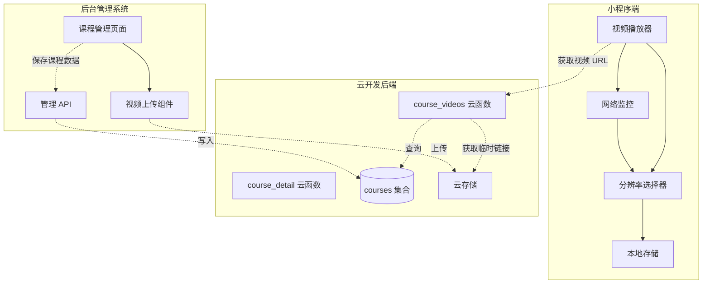
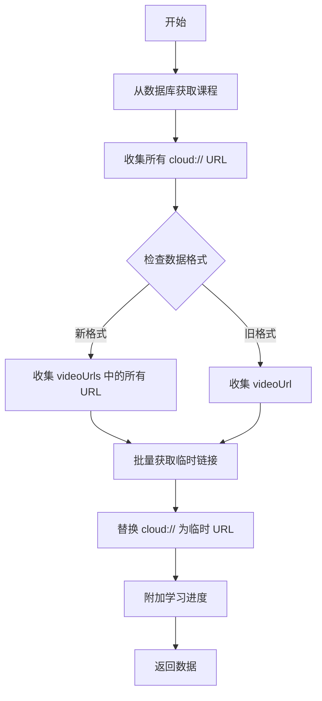
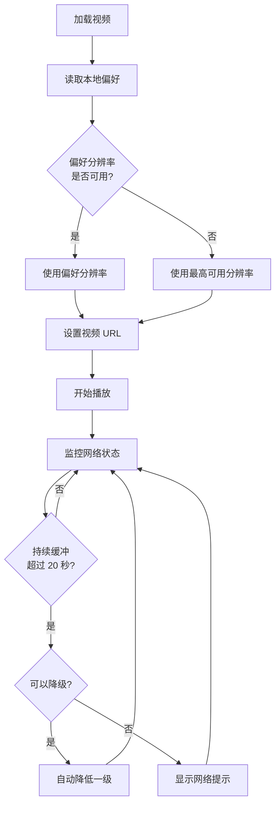
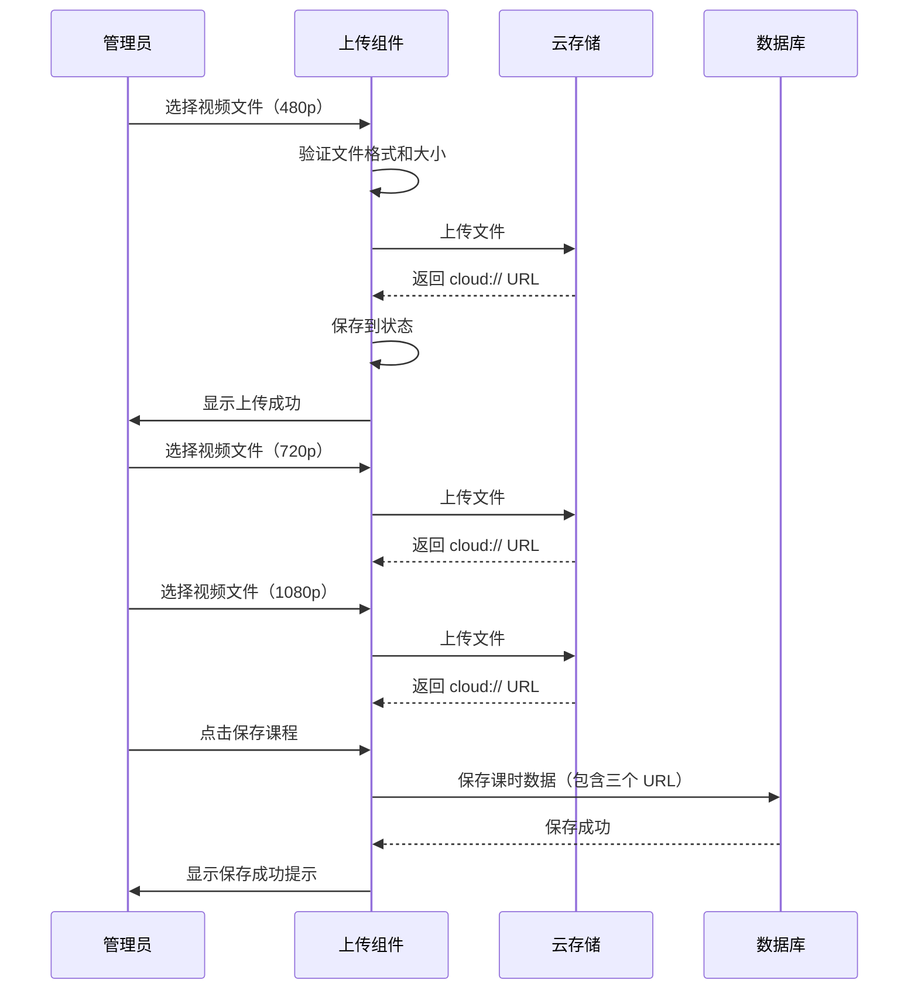

# 视频多分辨率选择功能 - 技术方案设计

## 1. 系统架构

### 1.1 整体架构



### 1.2 核心模块说明

| 模块 | 职责 | 位置 |
|------|------|------|
| 视频播放器 | 视频播放控制、进度管理、分辨率切换 | `video-player.js` |
| 分辨率选择器 | UI 交互、用户偏好管理、自动降级 | `video-player.js` |
| 本地存储 | 保存用户分辨率偏好 | 微信本地存储 API |
| 网络监控 | 检测缓冲状态、触发自动降级 | `video-player.js` |
| course_videos 云函数 | 获取视频数据、返回临时 URL | 云函数 |
| course_detail 云函数 | 获取课程详情 | 云函数 |
| 课程管理页面 | 后台课程 CRUD 操作 | React 组件 |
| 视频上传组件 | 多分辨率视频上传 | React 组件 |

---

## 2. 技术栈

### 2.1 小程序端
- **框架**: 微信小程序原生
- **视频组件**: `<video>` 原生组件
- **状态管理**: Page data + 本地存储
- **网络请求**: `wx.cloud.callFunction`
- **本地存储**: `wx.getStorageSync` / `wx.setStorageSync`

### 2.2 云函数
- **运行时**: Node.js 16+
- **SDK**: `wx-server-sdk`
- **数据库**: 云开发 NoSQL 数据库（MongoDB 风格）
- **云存储**: 腾讯云开发云存储

### 2.3 后台管理系统
- **框架**: React 19 + TypeScript
- **UI 组件库**: Ant Design 6.x
- **文件上传**: Ant Design Upload + 云开发 SDK
- **状态管理**: Zustand
- **API 请求**: 云开发 JS SDK

---

## 3. 数据库设计

### 3.1 课时数据模型（Lesson）

#### 新数据格式（推荐）

```typescript
interface Lesson {
  id: string;                    // 课时 ID，例如 "1.1"
  title: string;                 // 课时标题
  type: 'video' | 'file';        // 类型：视频或文件
  videoUrls?: {                  // 多分辨率视频 URL（新）
    '480p'?: string;             // 标清视频 cloud:// URL
    '720p'?: string;             // 高清视频 cloud:// URL
    '1080p'?: string;            // 超清视频 cloud:// URL
  };
  duration?: string;             // 视频时长，例如 "01:01:51"
  format?: string;               // 文件格式（文件类型课时使用）
  size?: string;                 // 文件大小（文件类型课时使用）
}
```

#### 旧数据格式（兼容）

```typescript
interface LegacyLesson {
  id: string;
  title: string;
  type: 'video' | 'file';
  videoUrl?: string;             // 单一视频 URL（旧）
  duration?: string;
}
```

#### 示例数据

```json
{
  "id": "1.1",
  "title": "1.1 灯光设计基础",
  "type": "video",
  "videoUrls": {
    "480p": "cloud://env-xxx.636f-env-xxx/courses/CO_DEFAULT_001/1.1-480p.mp4",
    "720p": "cloud://env-xxx.636f-env-xxx/courses/CO_DEFAULT_001/1.1-720p.mp4",
    "1080p": "cloud://env-xxx.636f-env-xxx/courses/CO_DEFAULT_001/1.1-1080p.mp4"
  },
  "duration": "01:01:51"
}
```

### 3.2 本地存储结构

```typescript
// Key: 'preferredQuality'
// Value: '480p' | '720p' | '1080p'

interface LocalStorage {
  preferredQuality: string;      // 用户偏好分辨率
}
```

---

## 4. 接口设计

### 4.1 云函数：course_videos

#### 输入参数

```typescript
interface CourseVideosInput {
  courseId: string;              // 课程 ID
  lessonId?: string;             // 可选：指定课时 ID
}
```

#### 输出数据（部分）

```typescript
interface CourseVideosOutput {
  success: boolean;
  data: {
    courseId: string;
    title: string;
    chapters: Array<{
      title: string;
      lessons: Array<{
        id: string;
        title: string;
        type: string;
        duration?: string;
        // ⭐ 新增：多分辨率 URL（已转换为临时链接）
        videoUrls?: {
          '480p'?: string;       // 临时 HTTPS URL
          '720p'?: string;
          '1080p'?: string;
        };
        // 兼容旧格式
        videoUrl?: string;
      }>;
    }>;
    currentLesson: Lesson;
  };
}
```

#### 核心逻辑



---

### 4.2 小程序端：分辨率选择逻辑

#### 数据结构

```typescript
// video-player.js data
interface VideoPlayerData {
  currentQuality: string;                // 当前分辨率，例如 '1080p'
  availableQualities: string[];          // 可用分辨率列表，例如 ['480p', '720p', '1080p']
  qualityLabels: {                       // 分辨率显示名称
    '480p': string;                      // '标清'
    '720p': string;                      // '高清'
    '1080p': string;                     // '超清'
  };
  currentLesson: {
    videoUrls?: Record<string, string>;  // 多分辨率 URL
    videoUrl?: string;                   // 旧格式兼容
  };
}
```

#### 核心方法

| 方法名 | 功能 | 输入 | 输出 |
|--------|------|------|------|
| `parseAvailableQualities(lesson)` | 解析课时支持的分辨率 | lesson 对象 | string[] |
| `getVideoUrlByQuality(lesson, quality)` | 获取指定分辨率的 URL | lesson, quality | string |
| `onSelectQuality(e)` | 用户手动选择分辨率 | event | void |
| `autoDowngradeQuality()` | 自动降级分辨率 | void | void |
| `restoreUserPreference()` | 恢复用户偏好 | void | string |

#### 分辨率选择流程



---

### 4.3 后台管理系统：视频上传接口

#### 组件设计

```typescript
interface VideoUploadProps {
  value?: {                              // 当前值（受控组件）
    '480p'?: string;
    '720p'?: string;
    '1080p'?: string;
  };
  onChange?: (value: VideoUrls) => void; // 值变化回调
}

interface VideoUploadState {
  uploading: {                           // 上传状态
    '480p': boolean;
    '720p': boolean;
    '1080p': boolean;
  };
  progress: {                            // 上传进度
    '480p': number;                      // 0-100
    '720p': number;
    '1080p': number;
  };
}
```

#### 上传流程



---

## 5. 核心算法

### 5.1 分辨率自动降级算法

```javascript
/**
 * 自动降级分辨率
 * @returns {string|null} 新的分辨率，如果无法降级则返回 null
 */
function autoDowngradeQuality() {
  const { currentQuality, availableQualities } = this.data;
  
  // 定义降级规则：1080p → 720p → 480p
  const qualityLevels = ['480p', '720p', '1080p'];
  const currentIndex = qualityLevels.indexOf(currentQuality);
  
  if (currentIndex <= 0) {
    // 已经是最低分辨率，无法降级
    return null;
  }
  
  // 从当前分辨率向下查找可用的分辨率
  for (let i = currentIndex - 1; i >= 0; i--) {
    const targetQuality = qualityLevels[i];
    if (availableQualities.includes(targetQuality)) {
      return targetQuality;
    }
  }
  
  return null;
}
```

### 5.2 网络缓冲检测算法

```javascript
/**
 * 网络缓冲检测逻辑
 */
class BufferingMonitor {
  constructor() {
    this.bufferingStartTime = null;     // 缓冲开始时间
    this.totalBufferingTime = 0;        // 累计缓冲时间（秒）
    this.THRESHOLD = 20;                // 缓冲阈值（秒）
  }
  
  /**
   * 视频开始缓冲
   */
  onBufferingStart() {
    if (!this.bufferingStartTime) {
      this.bufferingStartTime = Date.now();
      console.log('[BufferingMonitor] 缓冲开始');
    }
  }
  
  /**
   * 视频恢复播放
   */
  onBufferingEnd() {
    if (this.bufferingStartTime) {
      const duration = (Date.now() - this.bufferingStartTime) / 1000;
      this.totalBufferingTime += duration;
      this.bufferingStartTime = null;
      
      console.log('[BufferingMonitor] 本次缓冲:', duration, '秒');
      console.log('[BufferingMonitor] 累计缓冲:', this.totalBufferingTime, '秒');
      
      // 检查是否需要降级
      if (this.totalBufferingTime >= this.THRESHOLD) {
        this.triggerDowngrade();
      }
    }
  }
  
  /**
   * 触发自动降级
   */
  triggerDowngrade() {
    console.log('[BufferingMonitor] 触发自动降级');
    // 调用降级方法
    autoDowngradeQuality();
    // 重置计时器
    this.reset();
  }
  
  /**
   * 重置监控
   */
  reset() {
    this.bufferingStartTime = null;
    this.totalBufferingTime = 0;
  }
}
```

---

## 6. 安全性设计

### 6.1 视频 URL 安全

- ✅ 使用云存储临时链接（有效期 2 小时）
- ✅ 不在前端暴露永久 URL
- ✅ 云函数中验证用户购买状态
- ✅ 未购买用户无法获取视频 URL

### 6.2 后台管理权限

- ✅ 仅管理员可访问后台管理系统
- ✅ 使用云开发自定义登录验证管理员身份
- ✅ 文件上传前验证文件类型和大小

### 6.3 数据验证

- ✅ 云函数输入参数验证（courseId, lessonId）
- ✅ 前端表单验证（至少上传一个分辨率）
- ✅ 数据库写入前验证数据完整性

---

## 7. 性能优化

### 7.1 视频播放优化

| 优化项 | 实现方式 | 预期效果 |
|--------|---------|---------|
| 快速切换 | 记录播放位置，使用 seek() 跳转 | 切换时间 < 2 秒 |
| 预加载 | 优先加载当前课时的所有分辨率 URL | 减少切换延迟 |
| 批量转换 | 一次性获取所有课时的临时链接 | 减少云函数调用 |

### 7.2 云函数优化

```javascript
// 批量获取临时链接，减少 API 调用次数
async function batchGetTempFileURL(cloudFileIDs) {
  const BATCH_SIZE = 50;  // 每批最多 50 个
  const results = [];
  
  for (let i = 0; i < cloudFileIDs.length; i += BATCH_SIZE) {
    const batch = cloudFileIDs.slice(i, i + BATCH_SIZE);
    const res = await cloud.getTempFileURL({
      fileList: batch
    });
    results.push(...res.fileList);
  }
  
  return results;
}
```

### 7.3 前端性能

- ✅ 使用 `throttle` 限制网络检测频率
- ✅ 避免频繁的 `setData` 调用
- ✅ 使用本地变量存储播放状态（`_currentTime`, `_duration`）

---

## 8. 测试策略

### 8.1 单元测试

| 测试项 | 测试方法 | 预期结果 |
|--------|---------|---------|
| 分辨率解析 | `parseAvailableQualities()` | 正确解析新旧格式 |
| URL 获取 | `getVideoUrlByQuality()` | 返回正确的 URL |
| 自动降级 | `autoDowngradeQuality()` | 降级到下一级分辨率 |
| 用户偏好 | 本地存储读写 | 正确保存和恢复 |

### 8.2 集成测试

| 测试场景 | 测试步骤 | 预期结果 |
|---------|---------|---------|
| 手动切换 | 用户选择不同分辨率 | 视频平滑切换 |
| 自动降级 | 模拟网络变慢 | 自动降低分辨率 |
| 数据兼容 | 加载旧格式课程 | 正常播放 |
| 后台上传 | 管理员上传视频 | 正确保存到数据库 |

### 8.3 用户体验测试

- [ ] 切换分辨率时播放位置是否准确
- [ ] 自动降级时提示是否清晰
- [ ] UI 是否符合苹果设计风格
- [ ] 弱网环境下是否流畅

---

## 9. 部署计划

### 9.1 部署顺序

1. **第一阶段：云函数更新**
   - 更新 `course_videos` 云函数（支持多分辨率）
   - 更新 `course_detail` 云函数（兼容新格式）
   - 部署并测试

2. **第二阶段：小程序端更新**
   - 更新视频播放器组件
   - 添加分辨率选择 UI
   - 实现自动降级逻辑
   - 本地测试

3. **第三阶段：后台管理系统更新**
   - 添加多分辨率上传组件
   - 更新课程编辑表单
   - 测试上传流程

4. **第四阶段：数据迁移（可选）**
   - 如果需要迁移旧数据，运行迁移脚本
   - 验证数据完整性

5. **第五阶段：全量发布**
   - 小程序提交审核
   - 后台管理系统部署
   - 灰度发布

### 9.2 回滚方案

- 云函数支持新旧格式，回滚不影响旧版本小程序
- 小程序可快速回滚到上一版本
- 数据库新格式向后兼容，不影响旧版本

---

## 10. 风险评估

| 风险项 | 风险等级 | 缓解措施 |
|--------|---------|---------|
| 数据兼容性问题 | 中 | 充分测试新旧格式兼容性 |
| 视频切换卡顿 | 中 | 优化切换逻辑，预加载 URL |
| 云存储流量超限 | 低 | 监控流量，必要时降低默认分辨率 |
| 自动降级过于频繁 | 低 | 调整缓冲阈值（20 秒） |
| 后台上传失败 | 低 | 提供重试机制，显示清晰错误提示 |

---

## 11. 技术难点与解决方案

### 11.1 视频切换时的播放位置保持

**难点：** 切换分辨率时，如何确保视频从原位置继续播放，而不是从头开始。

**解决方案：**
```javascript
async onSelectQuality(e) {
  const quality = e.currentTarget.dataset.quality;
  
  // 1. 记录当前播放时间
  const currentTime = this._currentTime || 0;
  
  // 2. 暂停当前视频
  if (this.videoContext) {
    this.videoContext.pause();
  }
  
  // 3. 更换视频源
  this.setData({
    currentQuality: quality,
    'currentLesson.videoUrl': newVideoUrl
  });
  
  // 4. 延迟跳转到原位置（等待视频加载）
  setTimeout(() => {
    if (this.videoContext && currentTime > 0) {
      this.videoContext.seek(currentTime);
      this.videoContext.play();
    }
  }, 500);
}
```

### 11.2 新旧数据格式兼容

**难点：** 数据库中既有旧格式（单 `videoUrl`），又有新格式（`videoUrls` 对象），如何统一处理。

**解决方案：**
```javascript
function getVideoUrlByQuality(lesson, quality) {
  if (!lesson) return '';
  
  // 优先使用新格式
  if (lesson.videoUrls && lesson.videoUrls[quality]) {
    return lesson.videoUrls[quality];
  }
  
  // 兼容旧格式：将单 URL 视为 720p
  if (lesson.videoUrl && quality === '720p') {
    return lesson.videoUrl;
  }
  
  return '';
}
```

### 11.3 网络自适应降级的准确性

**难点：** 如何准确判断网络状况，避免误判导致频繁切换。

**解决方案：**
- 使用累计缓冲时间而非单次缓冲时间
- 设置合理的阈值（20 秒）
- 降级后重置计时器，避免连续降级
- 不自动升级，由用户手动选择

---

## 12. 相关文件清单

### 小程序端修改
- ✅ `pages/course/video-player/video-player.wxml` - 添加分辨率选择 UI
- ✅ `pages/course/video-player/video-player.js` - 实现选择和降级逻辑
- ✅ `pages/course/video-player/video-player.wxss` - 样式调整

### 云函数修改
- ✅ `cloudfunctions/course_videos/index.js` - 支持多分辨率 URL
- ⚠️ `cloudfunctions/course_detail/index.js` - 可能需要小幅调整（验证是否需要）

### 后台管理系统修改
- ✅ `Backend-management/guangyi-admin/src/pages/content/CourseList.tsx` - 课程管理页面
- ✅ `Backend-management/guangyi-admin/src/components/VideoUpload.tsx` - 新建：视频上传组件
- ✅ `Backend-management/guangyi-admin/src/types/index.ts` - 类型定义更新

---

**文档版本：** v1.0  
**创建日期：** 2025-01-06  
**最后更新：** 2025-01-06  
**作者：** AI Assistant  
**审核状态：** 待用户确认

