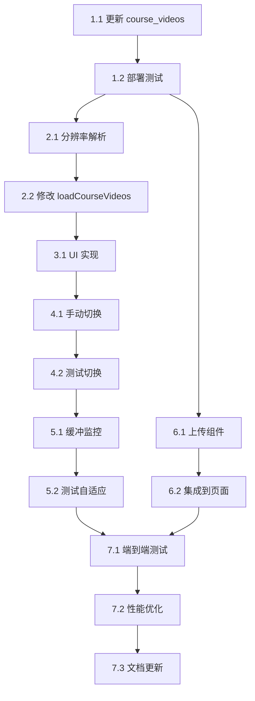

# 视频多分辨率选择功能 - 任务拆分

## 任务概述

本文档将视频多分辨率选择功能拆分为具体的开发任务，按照优先级和依赖关系组织，确保有序推进。

---

## 第一阶段：云函数更新（优先级：P0）

### 任务 1.1：更新 course_videos 云函数支持多分辨率

**负责模块：** 云函数  
**预计时间：** 2 小时  
**依赖：** 无

**具体工作：**
- [ ] 修改 `processChapters` 函数，支持解析 `videoUrls` 对象
- [ ] 收集所有分辨率的 cloud:// URL（480p、720p、1080p）
- [ ] 批量转换为临时 HTTPS URL
- [ ] 替换 `videoUrls` 中的每个 URL
- [ ] 兼容旧的 `videoUrl` 字段（向后兼容）
- [ ] 添加日志输出，记录数据格式判断过程
- [ ] 测试新旧格式数据

**验收标准：**
- ✅ 新格式课时：返回三个分辨率的临时 URL
- ✅ 旧格式课时：返回单个 videoUrl（兼容）
- ✅ 混合格式课程：正确处理每个课时
- ✅ 日志清晰，便于调试

**相关文件：**
- `cloudfunctions/course_videos/index.js`

**关键代码位置：**
- 第 227-240 行：收集 cloud:// URL 的逻辑
- 第 269-280 行：替换 URL 的逻辑

---

### 任务 1.2：部署并测试 course_videos 云函数

**负责模块：** 云函数  
**预计时间：** 30 分钟  
**依赖：** 任务 1.1

**具体工作：**
- [ ] 部署 `course_videos` 云函数到云端
- [ ] 在小程序端调用云函数，测试返回数据
- [ ] 验证新格式课时的 `videoUrls` 对象
- [ ] 验证旧格式课时的 `videoUrl` 字段
- [ ] 检查云函数日志，确认无错误

**验收标准：**
- ✅ 云函数部署成功
- ✅ 返回数据格式正确
- ✅ 临时 URL 可访问

_需求: 2.3.1 课时数据模型变更_

---

## 第二阶段：小程序端 - 数据解析（优先级：P0）

### 任务 2.1：实现分辨率解析方法

**负责模块：** 小程序视频播放器  
**预计时间：** 1 小时  
**依赖：** 任务 1.2

**具体工作：**
- [ ] 在 `video-player.js` 添加 `data` 字段：
  - `currentQuality`: '1080p'
  - `availableQualities`: []
  - `qualityLabels`: { '480p': '标清', '720p': '高清', '1080p': '超清' }
- [ ] 实现 `parseAvailableQualities(lesson)` 方法
  - 检查 `lesson.videoUrls` 是否存在
  - 提取所有可用的分辨率键（480p/720p/1080p）
  - 按分辨率从低到高排序
  - 兼容旧格式：如果只有 `videoUrl`，返回 ['720p']
- [ ] 实现 `getVideoUrlByQuality(lesson, quality)` 方法
  - 优先从 `videoUrls[quality]` 获取
  - 兼容旧格式：如果是 720p 且有 `videoUrl`，返回 `videoUrl`
  - 返回空字符串如果不存在
- [ ] 添加日志输出

**验收标准：**
- ✅ 新格式课时：正确解析出 1-3 个分辨率
- ✅ 旧格式课时：返回 ['720p']
- ✅ 获取 URL 方法返回正确的 URL 或空字符串

**相关文件：**
- `pages/course/video-player/video-player.js`

_需求: 2.1.1 分辨率选择 UI, 2.3.1 课时数据模型变更_

---

### 任务 2.2：修改 loadCourseVideos 方法

**负责模块：** 小程序视频播放器  
**预计时间：** 1 小时  
**依赖：** 任务 2.1

**具体工作：**
- [ ] 在 `loadCourseVideos` 方法中解析可用分辨率
  - 调用 `parseAvailableQualities(currentLesson)`
  - 保存到 `availableQualities`
- [ ] 恢复用户分辨率偏好
  - 从本地存储读取 `wx.getStorageSync('preferredQuality')`
  - 如果不存在，默认 '1080p'
  - 如果偏好不可用，降级到最高可用分辨率
- [ ] 根据选定分辨率设置视频 URL
  - 调用 `getVideoUrlByQuality(currentLesson, currentQuality)`
  - 设置到 `currentLesson.videoUrl`
- [ ] 更新 `setData`，包含 `currentQuality` 和 `availableQualities`

**验收标准：**
- ✅ 首次观看：自动使用 1080p
- ✅ 再次观看：使用上次保存的偏好
- ✅ 偏好不可用时：智能降级
- ✅ 视频 URL 正确设置

**相关文件：**
- `pages/course/video-player/video-player.js`（第 126-162 行）

_需求: 2.1.3 默认分辨率策略_

---

## 第三阶段：小程序端 - UI 实现（优先级：P0）

### 任务 3.1：添加分辨率选择 UI

**负责模块：** 小程序视频播放器  
**预计时间：** 1.5 小时  
**依赖：** 任务 2.2

**具体工作：**
- [ ] 修改 `video-player.wxml`，在播放选项弹窗中添加"清晰度"区域
  - 位置：倍速选项下方
  - 结构：`<view class="option-section">`
  - 标题：`<text class="option-label">清晰度</text>`
- [ ] 添加分辨率选项列表
  - 使用 `wx:for` 遍历 `availableQualities`
  - 每个选项：`<view class="quality-item">`
  - 绑定点击事件：`bindtap="onSelectQuality"`
  - 传递参数：`data-quality="{{item}}"`
  - 条件高亮：`{{currentQuality === item ? 'active' : ''}}`
  - 显示文本：`{{qualityLabels[item]}}`
- [ ] 修改 `video-player.wxss`，添加样式
  - `.quality-options`: 选项容器
  - `.quality-item`: 单个选项样式
  - `.quality-item.active`: 高亮样式（绿色背景）

**验收标准：**
- ✅ 打开"更多"弹窗，显示"清晰度"选项
- ✅ 显示所有可用分辨率
- ✅ 当前分辨率高亮显示（绿色）
- ✅ UI 风格与倍速选项一致

**相关文件：**
- `pages/course/video-player/video-player.wxml`（第 87-116 行附近）
- `pages/course/video-player/video-player.wxss`

_需求: 2.1.1 分辨率选择 UI_

---

## 第四阶段：小程序端 - 分辨率切换（优先级：P0）

### 任务 4.1：实现手动切换分辨率功能

**负责模块：** 小程序视频播放器  
**预计时间：** 2 小时  
**依赖：** 任务 3.1

**具体工作：**
- [ ] 实现 `onSelectQuality(e)` 方法
  - 获取选中的分辨率：`e.currentTarget.dataset.quality`
  - 如果与当前分辨率相同，直接返回
  - 记录当前播放时间：`this._currentTime`
  - 暂停视频：`this.videoContext.pause()`
  - 获取新分辨率的 URL：`getVideoUrlByQuality(currentLesson, quality)`
  - 验证 URL 是否存在，不存在则显示错误提示
  - 更新 `setData`：
    - `currentQuality`: 新分辨率
    - `'currentLesson.videoUrl'`: 新 URL
    - `showOptionsPanel`: false（关闭弹窗）
  - 保存用户偏好：`wx.setStorageSync('preferredQuality', quality)`
  - 延迟 500ms 后跳转到原播放位置：
    - `this.videoContext.seek(currentTime)`
    - `this.videoContext.play()`
  - 显示成功提示：`wx.showToast`
- [ ] 添加错误处理
  - URL 不存在时的提示
  - 切换失败时的回退逻辑

**验收标准：**
- ✅ 点击分辨率选项，视频平滑切换
- ✅ 播放位置保持不变（误差 < 1 秒）
- ✅ 显示"已切换到 XXX"提示
- ✅ 弹窗自动关闭
- ✅ 用户偏好已保存

**相关文件：**
- `pages/course/video-player/video-player.js`

_需求: 2.1.2 分辨率切换功能, 2.1.3 默认分辨率策略_

---

### 任务 4.2：测试切换功能

**负责模块：** 小程序视频播放器  
**预计时间：** 30 分钟  
**依赖：** 任务 4.1

**具体工作：**
- [ ] 测试从 1080p 切换到 720p
- [ ] 测试从 720p 切换到 480p
- [ ] 测试从 480p 切换到 1080p
- [ ] 测试播放位置是否准确
- [ ] 测试用户偏好是否保存
- [ ] 测试不可用分辨率的处理

**验收标准：**
- ✅ 所有切换组合均正常
- ✅ 播放位置误差 < 1 秒
- ✅ 无控制台错误

_需求: 2.1.2 分辨率切换功能_

---

## 第五阶段：小程序端 - 网络自适应（优先级：P1）

### 任务 5.1：实现缓冲监控逻辑

**负责模块：** 小程序视频播放器  
**预计时间：** 2 小时  
**依赖：** 任务 4.2

**具体工作：**
- [ ] 在 `onLoad` 中初始化缓冲监控变量
  - `this._bufferingStartTime = null`
  - `this._totalBufferingTime = 0`
  - `this._BUFFERING_THRESHOLD = 20`（秒）
- [ ] 修改 `onVideoWaiting(e)` 方法（缓冲开始）
  - 记录缓冲开始时间：`Date.now()`
  - 显示缓冲提示（已有逻辑）
- [ ] 修改 `onVideoPlay(e)` 方法（缓冲结束）
  - 计算本次缓冲时长：`(Date.now() - _bufferingStartTime) / 1000`
  - 累加到 `_totalBufferingTime`
  - 重置 `_bufferingStartTime`
  - 检查是否超过阈值：
    - 如果 `_totalBufferingTime >= _BUFFERING_THRESHOLD`
    - 调用 `autoDowngradeQuality()`
- [ ] 实现 `autoDowngradeQuality()` 方法
  - 获取当前分辨率索引
  - 查找下一级可用分辨率
  - 如果无法降级，显示"网络较慢"提示并返回
  - 调用 `switchQuality(targetQuality, 'auto')` 切换
  - 显示自动降级提示："网络较慢，已自动切换到 XXX 以保证流畅播放"
  - 重置缓冲计时器：`_totalBufferingTime = 0`
- [ ] 添加日志输出

**验收标准：**
- ✅ 累计缓冲超过 20 秒时，自动降级
- ✅ 显示明确的降级提示
- ✅ 降级后重置计时器
- ✅ 已是最低分辨率时，不降级，仅提示

**相关文件：**
- `pages/course/video-player/video-player.js`（第 228-370 行附近）

_需求: 2.1.4 网络自适应切换_

---

### 任务 5.2：测试网络自适应功能

**负责模块：** 小程序视频播放器  
**预计时间：** 1 小时  
**依赖：** 任务 5.1

**具体工作：**
- [ ] 使用微信开发者工具的网络节流功能模拟弱网
- [ ] 测试从 1080p 自动降级到 720p
- [ ] 测试从 720p 自动降级到 480p
- [ ] 测试 480p 无法降级的情况
- [ ] 验证提示文案是否清晰
- [ ] 验证降级后播放是否流畅

**验收标准：**
- ✅ 自动降级逻辑触发正常
- ✅ 提示文案友好
- ✅ 无控制台错误

_需求: 2.1.4 网络自适应切换_

---

## 第六阶段：后台管理系统（优先级：P1）

### 任务 6.1：创建视频上传组件

**负责模块：** 后台管理系统  
**预计时间：** 3 小时  
**依赖：** 任务 1.2

**具体工作：**
- [ ] 创建 `src/components/VideoUpload.tsx` 组件
- [ ] 定义 Props 接口：
  - `value`: { '480p'?: string, '720p'?: string, '1080p'?: string }
  - `onChange`: (value) => void
- [ ] 实现三个独立的上传区域（480p、720p、1080p）
- [ ] 每个区域包含：
  - 标题：如"480p 标清"
  - 上传按钮（Ant Design Upload 组件）
  - URL 输入框（支持直接输入 cloud:// URL）
  - 文件信息展示（已上传时）
  - 删除/替换按钮
- [ ] 实现上传逻辑：
  - 调用云开发 SDK 上传文件到云存储
  - 获取 cloud:// URL
  - 调用 `onChange` 更新父组件状态
- [ ] 添加文件验证：
  - 格式：仅允许 .mp4, .mov, .avi
  - 大小：最大 500MB
- [ ] 显示上传进度条
- [ ] 错误处理和提示

**验收标准：**
- ✅ 三个上传区域正常显示
- ✅ 可以上传视频文件
- ✅ 可以输入 cloud:// URL
- ✅ 显示上传进度
- ✅ 文件验证正常
- ✅ 错误提示清晰

**相关文件：**
- `Backend-management/guangyi-admin/src/components/VideoUpload.tsx`（新建）

_需求: 2.2.1 多分辨率视频上传_

---

### 任务 6.2：集成到课程编辑页面

**负责模块：** 后台管理系统  
**预计时间：** 2 小时  
**依赖：** 任务 6.1

**具体工作：**
- [ ] 修改 `CourseList.tsx`（或课程编辑表单）
- [ ] 在视频课时编辑区域，替换单一上传为 VideoUpload 组件
- [ ] 处理表单数据：
  - 从 `videoUrl` 迁移到 `videoUrls`
  - 保存时验证至少有一个分辨率
- [ ] 添加分辨率标签展示
  - 在课时列表中显示已上传的分辨率
  - 绿色实心标签：已上传
  - 灰色虚线标签：未上传
- [ ] 测试保存和编辑流程

**验收标准：**
- ✅ VideoUpload 组件正确集成
- ✅ 表单数据正确保存到数据库
- ✅ 分辨率标签正确显示
- ✅ 编辑现有课程时，正确回显已上传的视频

**相关文件：**
- `Backend-management/guangyi-admin/src/pages/content/CourseList.tsx`

_需求: 2.2.1 多分辨率视频上传, 2.2.2 分辨率标识展示_

---

## 第七阶段：测试与优化（优先级：P2）

### 任务 7.1：端到端测试

**负责模块：** 全栈  
**预计时间：** 2 小时  
**依赖：** 任务 6.2

**具体工作：**
- [ ] 完整测试场景 1：手动切换分辨率
- [ ] 完整测试场景 2：网络自适应降级
- [ ] 完整测试场景 3：分辨率偏好记忆
- [ ] 完整测试场景 4：后台管理多分辨率上传
- [ ] 完整测试场景 5：旧数据兼容性
- [ ] 记录所有发现的问题

**验收标准：**
- ✅ 所有测试场景通过
- ✅ 无严重 bug

_需求: 全部验收标准_

---

### 任务 7.2：性能优化

**负责模块：** 小程序  
**预计时间：** 1 小时  
**依赖：** 任务 7.1

**具体工作：**
- [ ] 优化分辨率切换速度
  - 减少 `setData` 调用次数
  - 优化视频跳转逻辑
- [ ] 优化网络监控性能
  - 使用节流限制检测频率
  - 避免阻塞主线程
- [ ] 检查内存泄漏
  - 确保定时器正确清理
  - 确保事件监听正确移除

**验收标准：**
- ✅ 切换分辨率响应时间 < 2 秒
- ✅ 无明显卡顿
- ✅ 无内存泄漏

_需求: 3.1 性能要求_

---

### 任务 7.3：文档更新

**负责模块：** 文档  
**预计时间：** 1 小时  
**依赖：** 任务 7.2

**具体工作：**
- [ ] 更新项目 README.md
  - 添加视频多分辨率功能说明
  - 更新数据结构文档
- [ ] 更新云函数 README（如果有）
- [ ] 添加后台管理使用说明

**验收标准：**
- ✅ README 信息完整
- ✅ 开发者可以根据文档理解功能

_需求: 无特定需求_

---

## 任务优先级说明

| 优先级 | 说明 | 任务 |
|--------|------|------|
| P0 | 核心功能，必须完成 | 任务 1.1 - 4.2 |
| P1 | 重要功能，建议完成 | 任务 5.1 - 6.2 |
| P2 | 优化和文档 | 任务 7.1 - 7.3 |

---

## 任务依赖关系图

---

## 时间估算

| 阶段 | 预计时间 | 累计时间 |
|------|---------|---------|
| 第一阶段：云函数 | 2.5 小时 | 2.5 小时 |
| 第二阶段：数据解析 | 2 小时 | 4.5 小时 |
| 第三阶段：UI 实现 | 1.5 小时 | 6 小时 |
| 第四阶段：分辨率切换 | 2.5 小时 | 8.5 小时 |
| 第五阶段：网络自适应 | 3 小时 | 11.5 小时 |
| 第六阶段：后台管理 | 5 小时 | 16.5 小时 |
| 第七阶段：测试优化 | 4 小时 | 20.5 小时 |

**总计：约 20.5 小时（2.5 个工作日）**

---

## 风险提示

1. **视频切换卡顿**
   - 风险：网络较慢时切换可能需要较长时间
   - 缓解：添加加载提示，优化切换逻辑

2. **旧数据兼容问题**
   - 风险：大量旧数据可能导致意外错误
   - 缓解：充分测试兼容性，添加防御性代码

3. **后台上传失败**
   - 风险：大文件上传可能超时
   - 缓解：添加重试机制，提供断点续传（如有需要）

---

**文档版本：** v1.0  
**创建日期：** 2025-01-06  
**最后更新：** 2025-01-06  
**作者：** AI Assistant  
**审核状态：** 待用户确认

